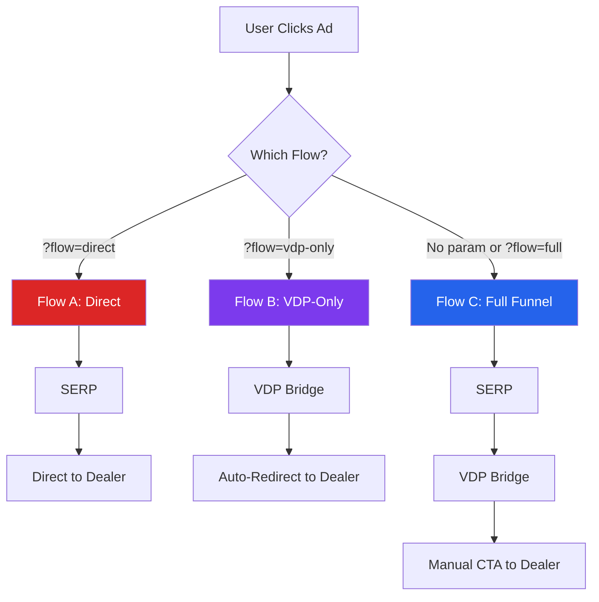

# A/B Testing Flows

## Three Flow Variants

Carzo implements URL parameter-based A/B testing to optimize conversion and maximize revenue per impression.

### Flow Decision Tree



### Flow A: Direct to Dealer

**URL Pattern:** `?flow=direct`

**Path:** SERP → Dealer Site (skip VDP)

**Strategy:** Minimal friction, test if VDP bridge adds or removes value

**UX:**
- Vehicle cards on search page link directly to dealer VDP
- Button text: "View at Dealer" (with ExternalLink icon)
- Opens dealer site in new tab immediately
- No intermediate VDP bridge page

**When to Use:**
- Test hypothesis: "VDP bridge page reduces conversion"
- Fast-track users who already know what they want
- Compare CTR and revenue vs Full Funnel

**Tracking:**
```typescript
// Click tracked with flow: 'direct'
{
  vehicle_id: 'uuid',
  dealer_id: 'dealer123',
  user_id: 'user-uuid',
  is_billable: true,
  cta_clicked: 'serp_direct',  // Unique to Flow A
  flow: 'direct'
}
```

### Flow B: VDP-Only

**URL Pattern:** `?flow=vdp-only`

**Path:** Ad → VDP Bridge → Dealer (skip SERP, auto-redirect)

**Strategy:** Vehicle-specific landing pages for targeted Facebook/Google ads

**UX:**
- Ad links directly to VDP: `/vehicles/VIN123?flow=vdp-only`
- VDP shows vehicle details with loading spinner
- After 1.5 seconds, auto-opens dealer site in new tab
- Impression + click tracked before redirect

**When to Use:**
- Facebook/Google ads for specific vehicles
- Landing page optimization (no SERP navigation)
- Test hypothesis: "Direct to VDP converts better than SERP"

**Tracking:**
```typescript
// Impression tracked on VDP load
{
  vehicle_id: 'uuid',
  user_id: 'user-uuid',
  page_type: 'direct',
  flow: 'vdp-only'
}

// Click tracked after 1.5s delay
{
  vehicle_id: 'uuid',
  dealer_id: 'dealer123',
  user_id: 'user-uuid',
  is_billable: true,
  cta_clicked: 'vdp_auto_redirect',  // Unique to Flow B
  flow: 'vdp-only'
}
```

### Flow C: Full Funnel (Default)

**URL Pattern:** No parameter or `?flow=full`

**Path:** SERP → VDP Bridge → Dealer (traditional flow)

**Strategy:** Full trust-building funnel with photo gallery tease

**UX:**
- Search page with filters and dealer-diversified results
- Vehicle card links to VDP: `/vehicles/VIN123`
- VDP bridge page with blurred photo gallery
- Primary CTA: "See Full Photo Gallery" (Camera icon)
- Manual click required to open dealer site

**When to Use:**
- Default experience for organic/referral traffic
- Maximum trust-building (confirm, tempt, convert)
- Baseline for A/B test comparisons

**Tracking:**
```typescript
// Impression tracked on SERP
{
  vehicle_id: 'uuid',
  user_id: 'user-uuid',
  page_type: 'search',
  flow: 'full'
}

// Click tracked on VDP CTA
{
  vehicle_id: 'uuid',
  dealer_id: 'dealer123',
  user_id: 'user-uuid',
  is_billable: true,
  cta_clicked: 'primary',  // Can be 'primary', 'history', 'payment'
  flow: 'full'
}
```

## Implementation Details

### Flow Detection (Client-Side)

```typescript
// lib/flow-detection.ts

export type UserFlow = 'direct' | 'vdp-only' | 'full';

/**
 * Detect flow from URL parameters
 * @returns UserFlow ('direct', 'vdp-only', or 'full')
 */
export function getFlowFromUrl(): UserFlow {
  if (typeof window === 'undefined') return 'full'; // SSR fallback

  const params = new URLSearchParams(window.location.search);
  const flow = params.get('flow');

  if (flow === 'direct' || flow === 'vdp-only') {
    return flow;
  }

  return 'full'; // Default
}
```

### Flow Preservation (Navigation)

**Critical:** Flow parameter must persist through all navigation (filters, pagination, sorting)

```typescript
// components/Search/FilterSidebar.tsx
'use client';

import { useRouter, useSearchParams } from 'next/navigation';
import { getFlowFromUrl } from '@/lib/flow-detection';

export default function FilterSidebar() {
  const router = useRouter();
  const searchParams = useSearchParams();

  const handleFilterChange = (make: string) => {
    // Preserve existing params (including flow)
    const params = new URLSearchParams(searchParams.toString());

    // Update filter
    params.set('make', make);

    // Preserve flow parameter
    const flow = getFlowFromUrl();
    if (flow !== 'full') {
      params.set('flow', flow);
    }

    // Navigate with updated params
    router.push(`/search?${params.toString()}`);
  };

  return <select onChange={(e) => handleFilterChange(e.target.value)}>...</select>;
}
```

**All Components That Preserve Flow:**
- FilterSidebar (make, model, price, condition, year, mileage, body style filters)
- Pagination (next/previous page)
- SortControls (price, year, mileage sorting)
- ClearFilters (preserves flow, clears other params)

### Conditional Routing (VehicleCard)

```typescript
// components/Search/VehicleCard.tsx
'use client';

import Link from 'next/link';
import { getFlowFromUrl } from '@/lib/flow-detection';

export default function VehicleCard({ vehicle }) {
  const flow = getFlowFromUrl();

  // Flow A: Direct link to dealer
  if (flow === 'direct') {
    return (
      <a
        href={vehicle.dealer_vdp_url}
        target="_blank"
        rel="noopener noreferrer"
        onClick={() => trackClick(vehicle, 'serp_direct')}
      >
        <VehicleCardContent vehicle={vehicle} />
        <Button variant="primary">
          View at Dealer <ExternalLink className="ml-2" />
        </Button>
      </a>
    );
  }

  // Flow B & C: Link to VDP bridge
  const searchParams = new URLSearchParams(window.location.search);
  const vdpUrl = `/vehicles/${vehicle.vin}?${searchParams.toString()}`;

  return (
    <Link href={vdpUrl}>
      <VehicleCardContent vehicle={vehicle} />
      <Button variant="primary">
        See Photos <Camera className="ml-2" />
      </Button>
    </Link>
  );
}
```

### VDP Auto-Redirect (Flow B)

```typescript
// app/vehicles/[vin]/page.tsx
'use client';

import { useEffect } from 'react';
import { getFlowFromUrl } from '@/lib/flow-detection';
import { getUserId, getSessionId } from '@/lib/user-tracking';

export default function VehiclePage({ vehicle }) {
  const flow = getFlowFromUrl();

  useEffect(() => {
    if (flow === 'vdp-only' && vehicle.dealer_vdp_url) {
      // Track impression
      trackImpression(vehicle.id, 'direct', flow);

      // Wait 1.5 seconds, then auto-redirect
      setTimeout(async () => {
        // Track click
        await fetch('/api/track-click', {
          method: 'POST',
          body: JSON.stringify({
            vehicleId: vehicle.id,
            dealerId: vehicle.dealer_id,
            userId: getUserId(),
            sessionId: getSessionId(),
            ctaClicked: 'vdp_auto_redirect',
            flow: 'vdp-only',
          }),
        });

        // Open dealer site
        window.open(vehicle.dealer_vdp_url, '_blank', 'noopener,noreferrer');
      }, 1500);
    }
  }, [flow, vehicle]);

  // Show loading spinner for Flow B
  if (flow === 'vdp-only') {
    return (
      <div className="flex flex-col items-center justify-center min-h-screen">
        <div className="animate-spin rounded-full h-16 w-16 border-t-2 border-b-2 border-primary" />
        <p className="mt-4 text-muted-foreground">Redirecting to dealer...</p>
      </div>
    );
  }

  // Normal VDP for Flow C
  return <VehicleBridgePage vehicle={vehicle} />;
}
```

## Database Schema

### Click Tracking with Flow

```sql
-- clicks table includes flow column
CREATE TABLE clicks (
  id UUID PRIMARY KEY DEFAULT gen_random_uuid(),
  vehicle_id UUID REFERENCES vehicles(id),
  dealer_id VARCHAR(50) NOT NULL,
  user_id VARCHAR(255) NOT NULL,
  session_id VARCHAR(255),
  is_billable BOOLEAN DEFAULT true,
  cta_clicked VARCHAR(50),
  flow VARCHAR(20),  -- 'direct', 'vdp-only', 'full'
  utm_source VARCHAR(255),
  utm_medium VARCHAR(255),
  utm_campaign VARCHAR(255),
  created_at TIMESTAMPTZ DEFAULT NOW()
);

-- Index for flow analytics
CREATE INDEX idx_clicks_flow ON clicks(flow);
```

### Impression Tracking with Flow

```sql
-- impressions table includes flow column
CREATE TABLE impressions (
  id UUID PRIMARY KEY DEFAULT gen_random_uuid(),
  vehicle_id UUID REFERENCES vehicles(id),
  user_id VARCHAR(255) NOT NULL,
  session_id VARCHAR(255),
  page_type VARCHAR(20),  -- 'search', 'homepage', 'direct'
  flow VARCHAR(20),  -- 'direct', 'vdp-only', 'full'
  created_at TIMESTAMPTZ DEFAULT NOW()
);

-- Index for flow analytics
CREATE INDEX idx_impressions_flow ON impressions(flow);
```

## Analytics & Metrics

### Key Metrics by Flow

**Flow A (Direct):**
- SERP impressions
- Direct clicks to dealer
- Billable click rate
- Revenue per impression
- Wasted clicks (duplicate dealers)

**Flow B (VDP-Only):**
- VDP impressions
- Auto-redirects (clicks)
- CTR (clicks / impressions)
- Billable click rate
- Revenue per impression

**Flow C (Full Funnel):**
- SERP impressions
- VDP impressions
- VDP clicks to dealer
- CTR (clicks / VDP impressions)
- Billable click rate
- Revenue per impression
- Session depth (SERP → VDP → Dealer)

### Analytics Dashboard Query

```sql
-- Flow performance comparison
WITH flow_stats AS (
  SELECT
    c.flow,
    COUNT(*) as total_clicks,
    COUNT(*) FILTER (WHERE c.is_billable) as billable_clicks,
    (COUNT(*) FILTER (WHERE c.is_billable)::FLOAT / COUNT(*) * 100) as billable_rate,
    (COUNT(*) FILTER (WHERE c.is_billable) * 0.80) as revenue,
    COUNT(DISTINCT c.user_id) as unique_users
  FROM clicks c
  WHERE c.created_at >= NOW() - INTERVAL '30 days'
  GROUP BY c.flow
),
impression_stats AS (
  SELECT
    i.flow,
    COUNT(*) as total_impressions
  FROM impressions i
  WHERE i.created_at >= NOW() - INTERVAL '30 days'
  GROUP BY i.flow
)
SELECT
  fs.flow,
  fs.total_clicks,
  fs.billable_clicks,
  fs.billable_rate,
  fs.revenue,
  fs.unique_users,
  COALESCE(ims.total_impressions, 0) as total_impressions,
  CASE
    WHEN ims.total_impressions > 0
    THEN (fs.total_clicks::FLOAT / ims.total_impressions * 100)
    ELSE 0
  END as ctr,
  CASE
    WHEN ims.total_impressions > 0
    THEN (fs.revenue / ims.total_impressions)
    ELSE 0
  END as revenue_per_impression
FROM flow_stats fs
LEFT JOIN impression_stats ims ON fs.flow = ims.flow
ORDER BY fs.revenue DESC;
```

**Sample Output:**
```
| flow      | clicks | billable | rate  | revenue | users | impr  | ctr   | rev/impr |
|-----------|--------|----------|-------|---------|-------|-------|-------|----------|
| full      | 1200   | 950      | 79.2% | $760.00 | 450   | 8500  | 14.1% | $0.089   |
| vdp-only  | 850    | 720      | 84.7% | $576.00 | 320   | 2100  | 40.5% | $0.274   |
| direct    | 600    | 420      | 70.0% | $336.00 | 280   | 3200  | 18.8% | $0.105   |
```

**Insights:**
- **Flow B (VDP-Only)** has highest CTR (40.5%) and revenue per impression ($0.274)
- **Flow C (Full Funnel)** has highest billable rate (79.2%) and total revenue ($760)
- **Flow A (Direct)** has lowest billable rate (70.0%) - hypothesis: less trust-building

### Dashboard Component

```typescript
// app/admin/page.tsx
export default async function AdminDashboard() {
  const { data: flowStats } = await supabase.rpc('get_flow_performance', {
    start_date: '2025-01-01',
    end_date: '2025-12-31',
  });

  return (
    <div className="grid grid-cols-3 gap-6">
      {flowStats.map(stat => (
        <Card key={stat.flow}>
          <CardHeader>
            <CardTitle>Flow {stat.flow === 'direct' ? 'A' : stat.flow === 'vdp-only' ? 'B' : 'C'}</CardTitle>
            <CardDescription>{stat.flow}</CardDescription>
          </CardHeader>
          <CardContent>
            <div className="space-y-2">
              <div>
                <span className="text-muted-foreground">Total Clicks:</span>
                <span className="font-semibold ml-2">{stat.total_clicks}</span>
              </div>
              <div>
                <span className="text-muted-foreground">Billable Rate:</span>
                <span className="font-semibold ml-2">{stat.billable_rate.toFixed(1)}%</span>
              </div>
              <div>
                <span className="text-muted-foreground">Revenue:</span>
                <span className="font-semibold ml-2">${stat.revenue.toFixed(2)}</span>
              </div>
              {stat.total_impressions > 0 && (
                <div>
                  <span className="text-muted-foreground">CTR:</span>
                  <span className="font-semibold ml-2">{stat.ctr.toFixed(1)}%</span>
                </div>
              )}
            </div>
          </CardContent>
        </Card>
      ))}
    </div>
  );
}
```

## Marketing Integration

### Facebook Ads Setup

**Flow A (Direct):**
```
Ad URL: https://carzo.net/search?make=Toyota&flow=direct
Target: Users who want fast access, minimal browsing
```

**Flow B (VDP-Only):**
```
Ad URL: https://carzo.net/vehicles/VIN123?flow=vdp-only
Target: Vehicle-specific ads (Carousel, Dynamic Product Ads)
```

**Flow C (Full Funnel):**
```
Ad URL: https://carzo.net/search?make=Toyota
Target: General audience, needs trust-building
```

### Google Display Network

**Flow A (Direct):**
- Banner ads with "View Now" CTA
- Direct to search results with flow=direct
- Retargeting campaigns for returning users

**Flow B (VDP-Only):**
- Vehicle-specific display ads
- Landing page: VDP with auto-redirect
- Best for high-intent users

**Flow C (Full Funnel):**
- Generic "Browse Cars" banner ads
- Landing page: Search with filters
- Cold audience targeting

## A/B Test Hypothesis

### Hypothesis 1: VDP Bridge Adds Value

**Test:** Flow A (Direct) vs Flow C (Full Funnel)

**Metrics:**
- CTR to dealer
- Billable click rate
- Revenue per impression
- Bounce rate

**Expected Outcome:**
- Flow C has higher billable rate (more trust-building)
- Flow A has higher CTR (less friction)
- Winner depends on revenue per impression

### Hypothesis 2: Auto-Redirect Converts Better

**Test:** Flow B (VDP-Only) vs Flow C (Full Funnel)

**Metrics:**
- CTR to dealer
- Time on site
- Revenue per impression

**Expected Outcome:**
- Flow B has higher CTR (auto-redirect)
- Flow C has longer time on site (manual browsing)
- Winner depends on revenue per impression

### Hypothesis 3: Dealer Diversification Impact

**Test:** Flow A with diversification vs without

**Metrics:**
- Dealer diversity score
- Unique dealers per session
- Revenue per session

**Expected Outcome:**
- Diversification increases unique dealers
- Higher revenue per session

## Edge Cases & Handling

### Edge Case 1: Invalid Flow Value

**URL:** `?flow=invalid`

**Handling:**
```typescript
export function getFlowFromUrl(): UserFlow {
  const params = new URLSearchParams(window.location.search);
  const flow = params.get('flow');

  // Only accept valid flows
  if (flow === 'direct' || flow === 'vdp-only') {
    return flow;
  }

  // Default to 'full' for invalid values
  return 'full';
}
```

### Edge Case 2: Missing dealer_vdp_url

**Problem:** Vehicle has no dealer URL (data issue)

**Flow A Handling:**
```typescript
// Fall back to VDP if dealer URL missing
if (flow === 'direct' && !vehicle.dealer_vdp_url) {
  return <Link href={`/vehicles/${vehicle.vin}`}>...</Link>;
}
```

**Flow B Handling:**
```typescript
// Show error instead of auto-redirect
if (flow === 'vdp-only' && !vehicle.dealer_vdp_url) {
  return (
    <div className="text-center p-8">
      <p className="text-error">Dealer URL not available.</p>
      <Button asChild>
        <Link href="/search">Return to Search</Link>
      </Button>
    </div>
  );
}
```

### Edge Case 3: Flow Parameter Lost

**Problem:** User shares URL without flow parameter

**Impact:** Defaults to Flow C (Full Funnel)

**Solution:** Use UTM parameters to reconstruct flow
```typescript
// If flow missing but utm_campaign contains flow hint
const campaign = params.get('utm_campaign');
if (!flow && campaign?.includes('vdp-only')) {
  return 'vdp-only';
}
```

## Testing Flows

### Manual Browser Testing

**Flow A:**
1. Navigate to `/search?make=Toyota&flow=direct`
2. Click vehicle card
3. Verify opens dealer site directly (no VDP)
4. Check database: `flow = 'direct'`, `cta_clicked = 'serp_direct'`

**Flow B:**
1. Navigate to `/vehicles/VIN123?flow=vdp-only`
2. Wait 1.5 seconds
3. Verify auto-opens dealer site
4. Check database: impression with `flow = 'vdp-only'`, click with `cta_clicked = 'vdp_auto_redirect'`

**Flow C:**
1. Navigate to `/search?make=Toyota`
2. Click vehicle card → VDP
3. Click "See Photos" CTA → Dealer site
4. Check database: `flow = 'full'`, `cta_clicked = 'primary'`

### Automated Testing (Future)

```typescript
// e2e/flows.test.ts
import { test, expect } from '@playwright/test';

test('Flow A: Direct to dealer', async ({ page }) => {
  await page.goto('/search?make=Toyota&flow=direct');

  const [newPage] = await Promise.all([
    page.waitForEvent('popup'),
    page.click('a[href*="dealer"]'),
  ]);

  expect(newPage.url()).toContain('dealer');
});

test('Flow B: VDP auto-redirect', async ({ page }) => {
  await page.goto('/vehicles/VIN123?flow=vdp-only');

  const [newPage] = await Promise.all([
    page.waitForEvent('popup'),
    page.waitForTimeout(2000),
  ]);

  expect(newPage.url()).toContain('dealer');
});
```

---

**Related Documentation:**
- [Business Model](./business-model.md) - Revenue optimization strategy
- [Architecture Overview](./architecture-overview.md) - A/B testing in system design
- [Analytics Dashboard](../how-to/monitoring.md) - How to monitor flow performance
