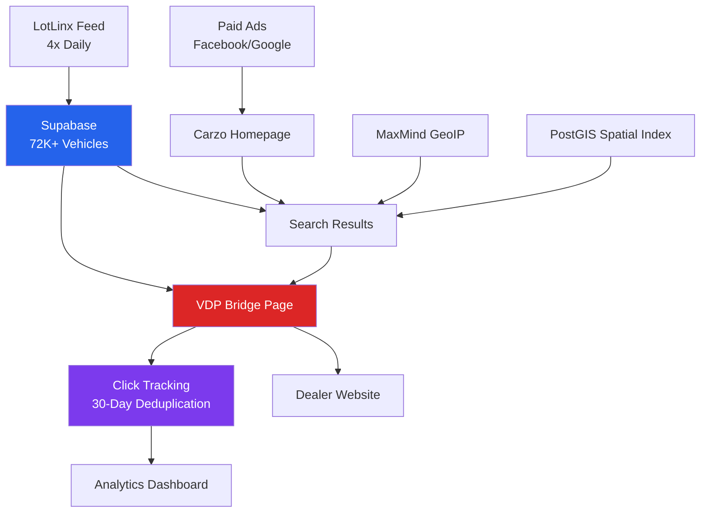
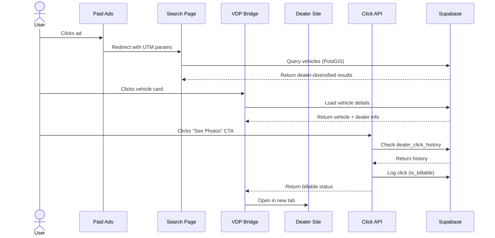

# Architecture Overview

## System Design

Carzo is a **conversion-optimized vehicle marketplace** that earns revenue by directing paid traffic to dealership websites through a VDP (Vehicle Detail Page) bridge strategy.

### High-Level Architecture

## Core Components

### 1. **Traffic Sources** (Paid Advertising)
- **Facebook Ads**: Mobile-first traffic to specific vehicles or search pages
- **Google Display Network**: Banner ads driving traffic to search results
- **URL Parameters**: `utm_source`, `utm_medium`, `utm_campaign` for tracking

**Revenue Model**: $0.80 per UNIQUE dealer click per user per 30 days

### 2. **Homepage** (`/`)
**Purpose**: Legitimacy + funnel to VDPs

**Components**:
- Hero search (make, model, zip code)
- Featured vehicles (dealer-diversified)
- Shop by make/body style
- Minimal content (just enough to look legitimate)

**Key**: Not a comprehensive car shopping site - focus is conversion

### 3. **Search Results** (`/search`)
**Purpose**: Filter & find vehicles → send to VDP

**Components**:
- Filter sidebar (make, model, price, condition, year, mileage, body style)
- Vehicle cards with "See Photos" CTA
- Pagination (20 vehicles per page)
- Location-based filtering (PostGIS spatial queries)

**Critical Feature**: Dealer diversification algorithm applied

### 4. **VDP Bridge Page** (`/vehicles/[vin]`) - THE MONEY PAGE
**Purpose**: Maximize CTR to dealer site (40%+ target)

**Strategy**: "Confirm, Tempt, Convert"
1. **Confirm**: Vehicle details, verified listing badge
2. **Tempt**: Blurred photo gallery ("+X More Photos")
3. **Convert**: Primary CTA "See Full Photo Gallery" → Dealer site

**All CTAs open dealer site in new tab** (`target="_blank"`)

### 5. **Feed Synchronization** (LotLinx)
**Source**: https://feed.lotlinx.com/
**Format**: ZIP → TSV (34 fields, 72K+ vehicles)
**Schedule**: 4x daily (03:00, 09:00, 15:00, 21:00 UTC)

**Process**:
1. Download ZIP from LotLinx
2. Extract TSV file
3. Parse vehicles (34 fields per row)
4. Upsert to Supabase (batch 1000)
5. Mark removed vehicles as inactive

**Budget Management**: Vehicles in feed = vehicles with active advertiser budgets

### 6. **Click Tracking** (Revenue Critical)
**Endpoint**: `/api/track-click`

**Process**:
1. User clicks dealer CTA
2. Check `dealer_click_history` (30-day window)
3. Mark as billable if first click to this dealer
4. Log click with `is_billable` flag
5. Update `dealer_click_history` table
6. Open dealer site in new tab

**Database Tables**:
- `clicks` - All click events
- `dealer_click_history` - Unique dealer clicks per user
- `impressions` - For CTR calculation

## Data Flow Diagram

## Technology Stack

### Frontend
- **Next.js 16** - App Router with Server Components
- **React 19** - UI library
- **Tailwind CSS v4** - Design system
- **TypeScript** - Type safety

### Backend
- **Supabase** - PostgreSQL database
- **PostGIS** - Spatial queries (100x faster)
- **Node.js** - API routes
- **Vercel** - Hosting + cron jobs

### External Services
- **LotLinx** - Vehicle inventory feed
- **MaxMind GeoIP2** - IP-based location detection
- **Vercel Cron** - Feed sync scheduling

## Performance Optimizations

### 1. **PostGIS Spatial Queries**
- **GIST spatial index** on `location` column
- ~50-100ms query time (vs. 3-5s client-side)
- Automatic distance calculation
- Server-side filtering

### 2. **On-Demand ISR** (Incremental Static Regeneration)
- Generate VDP pages on first access
- Cache for 6 hours
- Can't pre-generate 72K pages (too slow)

### 3. **Dealer Diversification Algorithm**
- Round-robin dealer rotation
- Maximizes unique dealer exposure
- Directly impacts revenue
- Applied to all vehicle lists

### 4. **Rate Limiting** (PostgreSQL-based)
- Unlogged tables (3x faster writes)
- Advisory locks (prevent race conditions)
- No external dependencies (no Redis)

### 5. **Image Optimization**
- Sharp for blur generation
- LotLinx CDN for vehicle photos
- Lazy loading
- Responsive images

## Security Architecture

### 1. **Rate Limiting**
- All POST endpoints protected
- Per-minute + burst limits
- PostgreSQL-based (no Redis)
- Returns 429 with retry-after header

### 2. **Cron Job Authentication**
- `CRON_SECRET` env var
- Vercel automatically adds auth header
- Bearer token validation

### 3. **Supabase RLS** (Row Level Security)
- Policies on all tables
- Service role key for server-side operations
- Anon key for client-side reads

### 4. **Anonymous User Tracking**
- Cookie-based (no JWT needed)
- No PII collected
- 1-year expiration
- GDPR/CCPA compliant

## Deployment Architecture

### Vercel Edge Network
- **CDN**: Global edge caching
- **Regions**: Auto-deployed worldwide
- **Cron Jobs**: Serverless functions (4x daily)
- **Environment Variables**: Encrypted at rest

### Supabase
- **Database**: PostgreSQL with PostGIS
- **Backups**: Automated daily backups
- **Connection Pooling**: PgBouncer
- **Monitoring**: Built-in observability

## Monitoring & Analytics

### Key Metrics
1. **Revenue Metrics**:
   - Billable clicks (unique dealers)
   - Revenue per session ($0.80 × unique dealers)
   - Wasted clicks (duplicate dealers)
   - Dealer diversity score

2. **Performance Metrics**:
   - Homepage LCP < 1.5s
   - Search response < 1s
   - VDP LCP < 2s
   - Database queries < 100ms p95

3. **User Behavior**:
   - CTR to dealers (target > 40% on VDP)
   - Session depth (pages per session)
   - Bounce rate
   - A/B test flow performance

### Analytics Dashboard
- Admin-only access (`/admin`)
- Password-protected
- Real-time click tracking
- Flow variant comparison

## Scalability Considerations

### Current Scale
- **72K+ vehicles** updated 4x daily
- **~100 req/min** search queries (rate limited)
- **~50 req/min** filter options (rate limited)
- **PostGIS queries**: ~50-100ms p95

### Growth Capacity
- **Database**: Supabase scales to millions of rows
- **PostGIS**: GIST index handles 10M+ locations efficiently
- **Vercel**: Auto-scales serverless functions
- **Rate Limiting**: Configurable per endpoint

## A/B Testing Architecture

### Three Flow Variants

**Flow A: Direct to Dealer** (`?flow=direct`)
- SERP → Dealer Site (skip VDP)
- Minimal friction
- Direct links from search results

**Flow B: VDP-Only** (`?flow=vdp-only`)
- Ad → VDP → Dealer (skip SERP, auto-redirect)
- Vehicle-specific landing pages
- For targeted ads

**Flow C: Full Funnel** (default)
- SERP → VDP → Dealer (traditional flow)
- Full trust-building funnel
- Photo gallery tease

### Flow Tracking
- `clicks.flow` - Which variant generated the click
- `impressions.flow` - Which variant generated the impression
- Analytics dashboard shows performance by flow

## Design Decisions

### Why Next.js 16?
- **Turbopack**: 2-5x faster builds
- **React 19 support**: Latest features
- **App Router**: Server Components by default
- **Vercel integration**: Seamless deployment

### Why Supabase?
- **PostgreSQL**: Industry standard
- **PostGIS**: Best-in-class spatial queries
- **RLS**: Built-in security
- **No vendor lock-in**: Standard Postgres

### Why Cookie Tracking (Not JWT)?
- **No authentication needed**: Anonymous users
- **Simpler**: Industry standard (Google Analytics, Facebook Pixel)
- **Faster**: No token validation overhead
- **Sufficient**: Just need to track dealer clicks

### Why PostgreSQL Rate Limiting (Not Redis)?
- **No external dependencies**: Everything in Supabase
- **No additional cost**: Included with Supabase
- **Sufficient performance**: Unlogged tables are fast enough
- **Simpler operations**: One database to manage

---

**Related Documentation**:
- [Business Model](./business-model.md) - Revenue calculation and constraints
- [Dealer Diversification](./dealer-diversification.md) - Algorithm explanation
- [PostGIS Spatial Queries](./postgis-spatial-queries.md) - Performance optimization
- [Rate Limiting Strategy](./rate-limiting-strategy.md) - Why PostgreSQL over Redis
