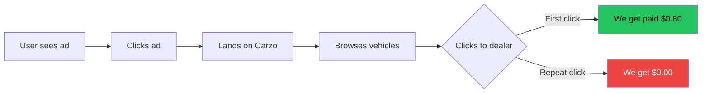

# Business Model

## Revenue Structure

**Carzo earns $0.80 per UNIQUE dealer click per user per 30 days**

### The Critical Constraint

⚠️ **MOST IMPORTANT RULE**: Multiple clicks to the same dealer = paid ONCE in 30-day window

This single constraint drives EVERY architectural and UX decision in the platform.

## How It Works

### 1. User Journey



### 2. Revenue Calculation

```typescript
// CORRECT - Only count billable clicks
const billableClicks = clicks.filter(c => c.is_billable).length;
const revenue = billableClicks * 0.80;

// WRONG - Would overcount
const revenue = totalClicks * 0.80;  // ❌ Includes duplicate dealers
```

### 3. Click Tracking with Deduplication

**Database Tables**:

```sql
-- clicks: All click events
CREATE TABLE clicks (
  id UUID PRIMARY KEY,
  vehicle_id UUID,
  dealer_id VARCHAR(50) NOT NULL,      -- CRITICAL for deduplication
  user_id VARCHAR(255) NOT NULL,        -- Cookie-based UUID
  session_id VARCHAR(255),
  is_billable BOOLEAN DEFAULT true,     -- First click to this dealer?
  cta_clicked VARCHAR(50),              -- 'primary', 'history', 'payment'
  flow VARCHAR(20),                     -- 'direct', 'vdp-only', 'full'
  created_at TIMESTAMP
);

-- dealer_click_history: Tracks unique dealer clicks per user
CREATE TABLE dealer_click_history (
  id UUID PRIMARY KEY,
  user_id VARCHAR(255) NOT NULL,
  dealer_id VARCHAR(50) NOT NULL,
  first_click_at TIMESTAMP NOT NULL,
  last_click_at TIMESTAMP NOT NULL,
  click_count INT DEFAULT 1,
  UNIQUE(user_id, dealer_id)
);
```

**Deduplication Logic**:

```typescript
// app/api/track-click/route.ts

// Check if user clicked this dealer in last 30 days
const thirtyDaysAgo = new Date(Date.now() - 30 * 24 * 60 * 60 * 1000);

const history = await supabase
  .from('dealer_click_history')
  .select('*')
  .eq('user_id', userId)
  .eq('dealer_id', dealerId)
  .gte('first_click_at', thirtyDaysAgo.toISOString());

// Mark as billable if first time
const isBillable = !history || history.length === 0;

// Log click with billable flag
await supabase.from('clicks').insert({
  vehicle_id: vehicleId,
  dealer_id: dealerId,
  user_id: userId,
  is_billable: isBillable,  // ← This is the money field
  created_at: new Date().toISOString(),
});
```

## Revenue Optimization Strategy

### Problem: Dealer Concentration Kills Revenue

**Scenario 1: No Diversification** (❌ BAD)
```
User session:
- Click Toyota at Dealer A → $0.80
- Click Honda at Dealer A → $0.00 (duplicate dealer!)
- Click Ford at Dealer A   → $0.00 (duplicate dealer!)
Total: $0.80 (wasted 2 clicks)
```

**Scenario 2: With Diversification** (✅ GOOD)
```
User session:
- Click Toyota at Dealer A → $0.80
- Click Honda at Dealer B → $0.80 (different dealer!)
- Click Ford at Dealer C  → $0.80 (different dealer!)
Total: $2.40 (3x more revenue!)
```

### Solution: Dealer Diversification Algorithm

**Applied to ALL vehicle lists**:
- Search results (max 1-2 vehicles per dealer per page)
- Featured vehicles on homepage
- Related vehicles on VDP
- ANY list showing multiple vehicles

**Algorithm**: `lib/dealer-diversity.ts`

```typescript
/**
 * Round-robin dealer rotation
 * Input:  [Toyota-DealerA, Toyota-DealerA, Ford-DealerB, Toyota-DealerC]
 * Output: [Toyota-DealerA, Ford-DealerB, Toyota-DealerC, Toyota-DealerA]
 */
export function diversifyByDealer<T extends { dealer_id: string }>(
  vehicles: T[],
  limit: number
): T[]
```

**Target**: >80% dealer diversity score

### Dealer Diversity Metrics

**Calculation**:
```typescript
// In a list of 20 vehicles, how many unique dealers?
const uniqueDealers = new Set(vehicles.map(v => v.dealer_id)).size;
const diversityScore = (uniqueDealers / vehicles.length) * 100;

// Goal: > 80% diversity
// Example: 16 unique dealers / 20 vehicles = 80%
```

**Why 80%?**
- Perfect 100% diversity is impossible (some makes/models limited)
- 80% means max 1-2 vehicles per dealer per page
- Maximizes revenue without sacrificing user experience

## Key Metrics

### 1. Revenue Metrics (Most Important)

**Unique Dealer Clicks Per Session** (THE MONEY METRIC)
```typescript
const uniqueDealers = new Set(
  clicks
    .filter(c => c.session_id === sessionId)
    .filter(c => c.is_billable)
    .map(c => c.dealer_id)
).size;

const sessionRevenue = uniqueDealers * 0.80;
```

**Wasted Clicks** (Efficiency Metric)
```typescript
const totalClicks = clicks.length;
const billableClicks = clicks.filter(c => c.is_billable).length;
const wastedClicks = totalClicks - billableClicks;
const wastePercentage = (wastedClicks / totalClicks) * 100;

// Goal: < 20% wasted clicks
```

**Dealer Diversity Score** (Quality Metric)
```typescript
// Calculated per page/list
const uniqueDealers = new Set(vehicles.map(v => v.dealer_id)).size;
const diversityScore = (uniqueDealers / vehicles.length) * 100;

// Goal: > 80% diversity
```

### 2. Performance Metrics

**CTR to Dealers** (Conversion Metric)
```typescript
const impressions = await supabase.from('impressions').select('*');
const clicks = await supabase.from('clicks').select('*');
const ctr = (clicks.length / impressions.length) * 100;

// Goal: > 40% CTR on VDP
// Goal: > 20% CTR on search results
```

**Revenue Per Session** (Efficiency Metric)
```typescript
const sessionsWithClicks = new Set(clicks.map(c => c.session_id)).size;
const totalRevenue = billableClicks.length * 0.80;
const revenuePerSession = totalRevenue / sessionsWithClicks;

// Goal: > $1.60 per session (2+ unique dealers)
```

### 3. User Behavior Metrics

**Session Depth** (Engagement Metric)
- Pages per session
- Time on site
- Vehicles viewed

**Bounce Rate** (Quality Metric)
- % of single-page sessions
- Goal: < 40%

## Analytics Dashboard

**Admin Dashboard** (`/admin`):
- Total clicks vs billable clicks
- Wasted clicks percentage
- Revenue (billable × $0.80)
- Top performing vehicles
- CTR by traffic source
- Dealer diversity metrics
- A/B test flow performance

## Traffic Sources & Attribution

### Paid Advertising Channels

**Facebook Ads**:
- Mobile-first traffic
- Targeted by location, demographics
- UTM params: `utm_source=facebook&utm_medium=cpc&utm_campaign=atlanta-toyota`

**Google Display Network**:
- Banner ads on automotive sites
- Retargeting campaigns
- UTM params: `utm_source=google&utm_medium=display&utm_campaign=retargeting`

### UTM Tracking

**Stored in clicks table**:
```sql
CREATE TABLE clicks (
  ...
  utm_source VARCHAR,     -- 'facebook', 'google'
  utm_medium VARCHAR,     -- 'cpc', 'display'
  utm_campaign VARCHAR,   -- Campaign identifier
  ...
);
```

**Revenue by Source**:
```typescript
const facebookRevenue = clicks
  .filter(c => c.utm_source === 'facebook')
  .filter(c => c.is_billable)
  .length * 0.80;

const googleRevenue = clicks
  .filter(c => c.utm_source === 'google')
  .filter(c => c.is_billable)
  .length * 0.80;
```

## Budget Management

### How Inventory Works

**Vehicles in feed = vehicles with active advertiser budgets**

When an advertiser's budget depletes:
1. Vehicle removed from LotLinx feed
2. Next feed sync marks vehicle as inactive
3. Vehicle no longer shown in search results

**No separate budget tracking needed on our side** - LotLinx handles it.

### Feed Sync Impact

**4x Daily Sync** (03:00, 09:00, 15:00, 21:00 UTC):
- Adds new vehicles (advertisers with budgets)
- Updates existing vehicles (price changes, etc.)
- Removes vehicles (budget depleted)

**Inventory Fluctuation**:
- Typical: 70K-75K active vehicles
- Can vary by time of day/week
- Higher inventory = more dealer diversity = more revenue potential

## Conversion Optimization

### VDP Bridge Strategy: "Confirm, Tempt, Convert"

**1. Confirm** (Build Trust)
- Vehicle details (year, make, model, price, mileage)
- Dealer information (name, city, state)
- Verified listing badge

**2. Tempt** (Create Desire)
- Blurred photo thumbnails (4 visible)
- "+X More Photos" text
- Professional vehicle photos from LotLinx CDN

**3. Convert** (Remove Friction)
- Primary CTA: "See Full Photo Gallery"
- Secondary CTAs: "View FREE Vehicle History", "Estimate Monthly Payments"
- All CTAs open dealer site in new tab (keep user on our site)

**Target**: 40%+ CTR to dealer site

### Mobile Optimization

**Why Mobile-First?**
- 70%+ of paid ad traffic is mobile (Facebook, Google Display)
- Touch-friendly CTAs (40x40px minimum)
- Fast load times (< 2s LCP)
- Simplified navigation

**Mobile UX**:
- Filter drawer (not sidebar)
- Larger tap targets
- Thumb-friendly button placement
- Responsive images

## Risk Mitigation

### Preventing Revenue Leakage

**1. Duplicate Dealer Detection**
- Track all clicks in `dealer_click_history`
- 30-day rolling window
- `is_billable` flag prevents overcounting

**2. Dealer Diversification Enforcement**
- Applied to ALL vehicle lists
- Automated algorithm (not manual curation)
- Monitored via diversity score metric

**3. Click Fraud Prevention**
- Rate limiting (PostgreSQL-based)
- IP tracking
- User agent validation
- Cookie-based user identification

**4. Quality Control**
- Remove inactive vehicles (feed sync)
- Verify dealer URLs (LotLinx provides)
- Monitor CTR by vehicle (remove low performers)

---

**Related Documentation**:
- [Architecture Overview](./architecture-overview.md) - System design
- [Dealer Diversification](./dealer-diversification.md) - Algorithm details
- [A/B Testing Flows](./ab-testing-flows.md) - Flow variants
