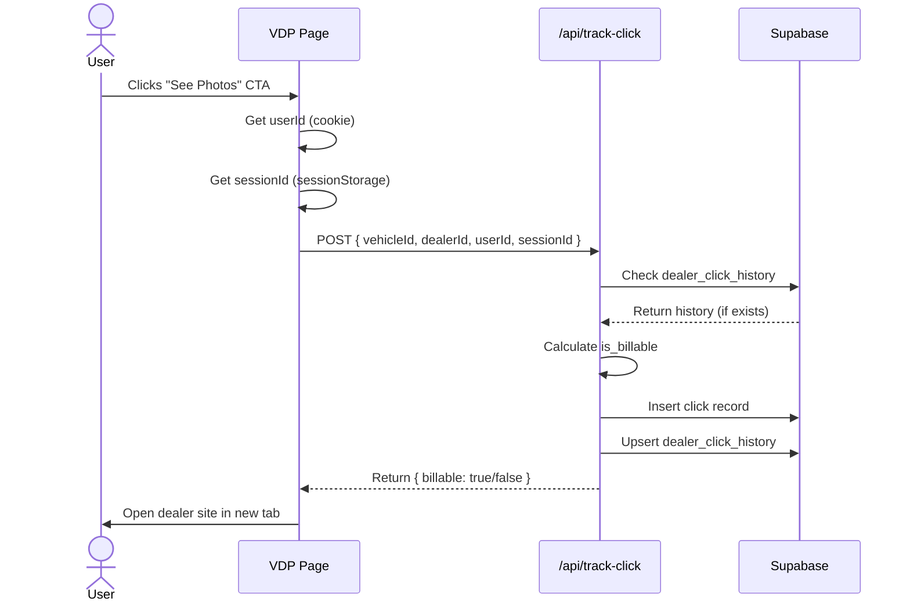

# Cookie Tracking

## Why Cookies, Not JWT?

### The Decision

Carzo uses **cookie-based anonymous user tracking** instead of JWT (JSON Web Tokens).

**Reasoning:**
1. **No User Accounts** - Anonymous users don't need authentication
2. **Simpler Implementation** - No token refresh, expiration, signing
3. **Industry Standard** - Google Analytics, Facebook Pixel use cookies
4. **Better Performance** - No token validation overhead
5. **Sufficient for Use Case** - Just need to track dealer clicks

### When JWT Makes Sense

**JWT is better when:**
- User authentication required (login/logout)
- API access tokens needed
- Microservices architecture (token-based auth)
- Stateless authentication required

**Our Use Case:**
- No user accounts ✅
- Anonymous tracking only ✅
- Single application (no microservices) ✅
- Persistent user ID across sessions ✅

**Verdict:** Cookies are simpler and sufficient

## Cookie Architecture

### Cookie Structure

**Cookie Name:** `carzo_user_id`

**Cookie Value:** UUID v4 (e.g., `550e8400-e29b-41d4-a916-446655440000`)

**Cookie Attributes:**
```typescript
document.cookie = `carzo_user_id=${userId}; max-age=31536000; path=/; SameSite=Lax; Secure`;
```

**Breakdown:**
- `max-age=31536000` - 1 year expiration (365 days)
- `path=/` - Available across entire site
- `SameSite=Lax` - Sent on same-site requests + top-level navigation
- `Secure` - HTTPS only (production)
- `HttpOnly` - NOT set (JavaScript needs access)

### Why Not HttpOnly?

**HttpOnly Cookie:**
- Inaccessible to JavaScript (only HTTP requests)
- More secure (XSS protection)
- **Problem:** Can't read client-side for analytics tracking

**Our Approach:**
- JavaScript-accessible cookie
- Used for client-side tracking (impressions, clicks)
- Trade-off: Slightly less secure, but necessary for analytics

**Mitigation:**
- No sensitive data in cookie (just UUID)
- XSS protection via Content Security Policy
- Input sanitization on all user inputs

## User Tracking Implementation

### Client-Side: Getting User ID

```typescript
// lib/user-tracking.ts

/**
 * Get or create persistent user ID
 * @returns UUID string
 */
export function getUserId(): string {
  // Check if cookie exists
  const cookies = document.cookie.split('; ');
  const userIdCookie = cookies.find(c => c.startsWith('carzo_user_id='));

  if (userIdCookie) {
    // Extract UUID from cookie
    return userIdCookie.split('=')[1];
  }

  // Generate new UUID
  const newUserId = crypto.randomUUID();

  // Set cookie (1 year expiration)
  document.cookie = `carzo_user_id=${newUserId}; max-age=31536000; path=/; SameSite=Lax; Secure`;

  return newUserId;
}
```

**When Called:**
- Page load (React useEffect)
- Before tracking click/impression
- Analytics event tracking

### Client-Side: Getting Session ID

```typescript
// lib/user-tracking.ts

/**
 * Get or create per-tab session ID
 * @returns UUID string
 */
export function getSessionId(): string {
  // Check sessionStorage (per-tab, cleared on close)
  const sessionId = sessionStorage.getItem('carzo_session_id');

  if (sessionId) {
    return sessionId;
  }

  // Generate new session ID
  const newSessionId = crypto.randomUUID();
  sessionStorage.setItem('carzo_session_id', newSessionId);

  return newSessionId;
}
```

**Key Difference:**
- **User ID (cookie):** Persists across sessions (1 year)
- **Session ID (sessionStorage):** Per-tab, cleared on tab close

**Use Cases:**
- User ID: Click deduplication (30-day window)
- Session ID: Analytics (pages per session, time on site)

### Server-Side: Reading User ID

```typescript
// app/api/track-click/route.ts
import { NextRequest, NextResponse } from 'next/server';

export async function POST(request: NextRequest) {
  // Read cookie from request headers
  const userId = request.cookies.get('carzo_user_id')?.value;

  if (!userId) {
    return NextResponse.json(
      { error: 'User ID not found' },
      { status: 400 }
    );
  }

  // Use userId for deduplication logic
  // ...
}
```

**Server-Side Access:**
- Available in API routes via `request.cookies`
- No need to parse cookie string manually
- Next.js handles cookie parsing

## Click Tracking Flow

### Step-by-Step Process



### 1. User Clicks CTA

```typescript
// components/VDP/VehicleBridgePage.tsx
'use client';

import { getUserId, getSessionId } from '@/lib/user-tracking';

export default function VehicleBridgePage({ vehicle }) {
  const handleCTAClick = async (ctaType: string) => {
    const userId = getUserId();
    const sessionId = getSessionId();

    // Track click
    const response = await fetch('/api/track-click', {
      method: 'POST',
      headers: { 'Content-Type': 'application/json' },
      body: JSON.stringify({
        vehicleId: vehicle.id,
        dealerId: vehicle.dealer_id,
        userId,
        sessionId,
        ctaClicked: ctaType, // 'primary', 'history', 'payment'
      }),
    });

    const { billable } = await response.json();

    // Optional: Show UI feedback
    if (!billable) {
      console.log('Already clicked this dealer in last 30 days');
    }

    // Open dealer site in new tab
    window.open(vehicle.dealer_vdp_url, '_blank', 'noopener,noreferrer');
  };

  return (
    <button onClick={() => handleCTAClick('primary')}>
      See Full Photo Gallery
    </button>
  );
}
```

### 2. API Route Processes Click

```typescript
// app/api/track-click/route.ts
export async function POST(request: NextRequest) {
  const { vehicleId, dealerId, userId, sessionId, ctaClicked } = await request.json();

  // Check dealer click history (30-day window)
  const thirtyDaysAgo = new Date(Date.now() - 30 * 24 * 60 * 60 * 1000);

  const { data: history } = await supabase
    .from('dealer_click_history')
    .select('*')
    .eq('user_id', userId)
    .eq('dealer_id', dealerId)
    .gte('first_click_at', thirtyDaysAgo.toISOString());

  // Mark as billable if first time
  const isBillable = !history || history.length === 0;

  // Log click with billable flag
  await supabase.from('clicks').insert({
    vehicle_id: vehicleId,
    dealer_id: dealerId,
    user_id: userId,
    session_id: sessionId,
    is_billable: isBillable,
    cta_clicked: ctaClicked,
    created_at: new Date().toISOString(),
  });

  // Update dealer click history
  if (isBillable) {
    await supabase.from('dealer_click_history').insert({
      user_id: userId,
      dealer_id: dealerId,
      first_click_at: new Date().toISOString(),
      last_click_at: new Date().toISOString(),
      click_count: 1,
    });
  } else {
    await supabase
      .from('dealer_click_history')
      .update({
        last_click_at: new Date().toISOString(),
        click_count: supabase.rpc('increment', { x: 1 }),
      })
      .eq('user_id', userId)
      .eq('dealer_id', dealerId);
  }

  return NextResponse.json({ billable: isBillable });
}
```

## Impression Tracking

### What Are Impressions?

**Impression:** Vehicle shown to user (search results, homepage, VDP)

**Why Track Impressions?**
- Calculate CTR (click-through rate)
- Measure vehicle performance
- A/B test effectiveness
- Revenue per impression

### Implementation

```typescript
// components/Search/VehicleCard.tsx
'use client';

import { useEffect } from 'react';
import { getUserId, getSessionId } from '@/lib/user-tracking';

export default function VehicleCard({ vehicle }) {
  useEffect(() => {
    // Track impression when card enters viewport
    const userId = getUserId();
    const sessionId = getSessionId();

    fetch('/api/track-impression', {
      method: 'POST',
      headers: { 'Content-Type': 'application/json' },
      body: JSON.stringify({
        vehicleId: vehicle.id,
        userId,
        sessionId,
        pageType: 'search',
      }),
    });
  }, [vehicle.id]);

  return <div>...</div>;
}
```

**API Route:**
```typescript
// app/api/track-impression/route.ts
export async function POST(request: NextRequest) {
  const { vehicleId, userId, sessionId, pageType } = await request.json();

  await supabase.from('impressions').insert({
    vehicle_id: vehicleId,
    user_id: userId,
    session_id: sessionId,
    page_type: pageType, // 'search', 'homepage', 'direct'
    created_at: new Date().toISOString(),
  });

  return NextResponse.json({ success: true });
}
```

## Privacy & Compliance

### GDPR Compliance

**Requirements:**
- ✅ User consent for non-essential cookies
- ✅ Clear privacy policy
- ✅ Data deletion on request
- ✅ No PII (Personally Identifiable Information) stored

**Our Implementation:**
- Cookie banner (on first visit)
- Privacy policy page
- No email, name, phone collected
- Anonymous UUID only

**Cookie Banner:**
```typescript
// components/CookieBanner.tsx
'use client';

import { useState, useEffect } from 'react';

export default function CookieBanner() {
  const [showBanner, setShowBanner] = useState(false);

  useEffect(() => {
    // Check if user already consented
    const consented = localStorage.getItem('cookie_consent');
    if (!consented) {
      setShowBanner(true);
    }
  }, []);

  const handleAccept = () => {
    localStorage.setItem('cookie_consent', 'true');
    setShowBanner(false);
  };

  if (!showBanner) return null;

  return (
    <div className="fixed bottom-0 left-0 right-0 bg-muted p-4 z-50">
      <p>
        We use cookies to track dealer clicks. No personal data collected.{' '}
        <a href="/privacy">Privacy Policy</a>
      </p>
      <button onClick={handleAccept}>Accept</button>
    </div>
  );
}
```

### CCPA Compliance (California)

**Requirements:**
- ✅ "Do Not Sell My Info" link
- ✅ User data deletion on request
- ✅ Disclosure of data collection practices

**Our Implementation:**
- Footer link to privacy page
- Email for data deletion requests
- No data selling (tracking for internal use only)

### Cookie Deletion

**User-Initiated:**
```typescript
// lib/user-tracking.ts

export function deleteUserData() {
  // Delete cookie
  document.cookie = 'carzo_user_id=; max-age=0; path=/';

  // Clear sessionStorage
  sessionStorage.removeItem('carzo_session_id');

  // Optional: Call API to delete database records
  fetch('/api/delete-user-data', {
    method: 'POST',
    body: JSON.stringify({ userId: getUserId() }),
  });
}
```

**Database Cleanup:**
```sql
-- Delete user data from database
DELETE FROM clicks WHERE user_id = 'user-uuid-here';
DELETE FROM impressions WHERE user_id = 'user-uuid-here';
DELETE FROM dealer_click_history WHERE user_id = 'user-uuid-here';
```

## Edge Cases & Handling

### 1. Cookie Blocked (Browser Settings)

**Problem:** User has cookies disabled

**Detection:**
```typescript
function areCookiesEnabled(): boolean {
  try {
    document.cookie = 'test=1';
    const enabled = document.cookie.includes('test=1');
    document.cookie = 'test=; max-age=0';
    return enabled;
  } catch {
    return false;
  }
}
```

**Fallback:**
```typescript
export function getUserId(): string {
  if (!areCookiesEnabled()) {
    // Fallback to sessionStorage (per-tab, not persistent)
    let userId = sessionStorage.getItem('carzo_user_id');
    if (!userId) {
      userId = crypto.randomUUID();
      sessionStorage.setItem('carzo_user_id', userId);
    }
    return userId;
  }

  // Normal cookie logic
  // ...
}
```

**Impact:** User ID resets on tab close (acceptable trade-off)

### 2. Incognito/Private Mode

**Behavior:**
- Cookies work normally
- Deleted when browser closes
- Each session has new user ID

**Impact:**
- Same user = multiple user IDs (over-counting users)
- Not a problem for revenue (we want to track clicks)

### 3. Cookie Deleted Mid-Session

**Problem:** User manually deletes cookie

**Detection:**
```typescript
export function getUserId(): string {
  const userId = getCookieValue('carzo_user_id');

  if (!userId) {
    // Cookie was deleted, generate new one
    const newUserId = crypto.randomUUID();
    document.cookie = `carzo_user_id=${newUserId}; max-age=31536000; path=/; SameSite=Lax; Secure`;
    return newUserId;
  }

  return userId;
}
```

**Impact:** New user ID, click deduplication resets (acceptable)

### 4. Shared Device (Multiple Users)

**Problem:** Family shares computer, all get same user ID

**Impact:**
- Multiple people tracked as one user
- Click deduplication across all users
- **Acceptable:** Edge case, revenue impact minimal

**Potential Enhancement (Future):**
- Browser fingerprinting (more accurate)
- IP + User Agent hashing
- Machine learning to detect user switching

### 5. Bot Traffic

**Problem:** Bots generate fake user IDs and clicks

**Detection:**
```typescript
// app/api/track-click/route.ts
export async function POST(request: NextRequest) {
  // Check User Agent
  const userAgent = request.headers.get('user-agent') || '';
  if (userAgent.includes('bot') || userAgent.includes('crawler')) {
    return NextResponse.json({ error: 'Bot detected' }, { status: 403 });
  }

  // Check rate limiting (prevents automated clicks)
  const rateLimitResult = await checkRateLimit(userId, 'track_click', 50, 60);
  if (!rateLimitResult.allowed) {
    return NextResponse.json({ error: 'Rate limit exceeded' }, { status: 429 });
  }

  // Continue with click tracking
  // ...
}
```

**Additional Mitigations:**
- Rate limiting (PostgreSQL-based)
- Cloudflare bot protection (upstream)
- IP reputation scoring (future)

## Analytics Integration

### Google Analytics 4 (Future)

```typescript
// lib/analytics.ts
declare global {
  interface Window {
    gtag: (...args: any[]) => void;
  }
}

export function trackEvent(eventName: string, params: Record<string, any>) {
  if (typeof window !== 'undefined' && window.gtag) {
    window.gtag('event', eventName, {
      ...params,
      user_id: getUserId(), // Link to our internal user ID
    });
  }
}
```

**Usage:**
```typescript
// Track click event
trackEvent('dealer_click', {
  dealer_id: vehicle.dealer_id,
  vehicle_id: vehicle.id,
  is_billable: true,
});
```

**Benefits:**
- Unified user tracking (Google + Carzo)
- Cross-domain tracking (if needed)
- Standard analytics dashboard

### Custom Analytics Dashboard

```typescript
// app/admin/page.tsx
export default async function AdminDashboard() {
  // Query clicks grouped by user
  const { data: userStats } = await supabase.rpc('get_user_stats', {
    start_date: '2025-01-01',
    end_date: '2025-12-31',
  });

  return (
    <div>
      <h1>User Analytics</h1>
      <ul>
        {userStats.map(stat => (
          <li key={stat.user_id}>
            User: {stat.user_id} - Clicks: {stat.total_clicks} - Billable: {stat.billable_clicks}
          </li>
        ))}
      </ul>
    </div>
  );
}
```

**Stored Procedure:**
```sql
CREATE FUNCTION get_user_stats(
  start_date DATE,
  end_date DATE
) RETURNS TABLE (
  user_id TEXT,
  total_clicks BIGINT,
  billable_clicks BIGINT,
  unique_dealers BIGINT,
  revenue DECIMAL(10,2)
) AS $$
BEGIN
  RETURN QUERY
  SELECT
    c.user_id,
    COUNT(*) as total_clicks,
    COUNT(*) FILTER (WHERE c.is_billable) as billable_clicks,
    COUNT(DISTINCT c.dealer_id) FILTER (WHERE c.is_billable) as unique_dealers,
    (COUNT(*) FILTER (WHERE c.is_billable) * 0.80)::DECIMAL(10,2) as revenue
  FROM clicks c
  WHERE c.created_at >= start_date AND c.created_at <= end_date
  GROUP BY c.user_id
  ORDER BY revenue DESC;
END;
$$ LANGUAGE plpgsql;
```

## Performance Considerations

### Cookie Read Performance

**Benchmark:**
- `document.cookie` read: < 0.1ms
- UUID generation: < 0.5ms
- Cookie write: < 0.5ms

**Total Overhead:** ~1ms per page load (negligible)

### Database Query Performance

**Click Tracking Query:**
```sql
-- Check dealer click history (30-day window)
SELECT * FROM dealer_click_history
WHERE user_id = 'uuid' AND dealer_id = 'dealer123'
  AND first_click_at >= NOW() - INTERVAL '30 days';
```

**Performance:**
- Index on (user_id, dealer_id): Yes
- Query time: ~5-10ms
- Total click tracking: ~50ms (including upserts)

**Not a Bottleneck:** PostGIS queries take 10x longer

---

**Related Documentation:**
- [Business Model](./business-model.md) - Why click tracking matters
- [Architecture Overview](./architecture-overview.md) - Cookie tracking in system design
- [Privacy Policy](../legal/privacy-policy.md) - User-facing privacy documentation
