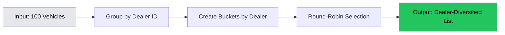

# Dealer Diversification

## The Problem: Dealer Concentration Kills Revenue

### Revenue Constraint Recap

**We only get paid $0.80 per UNIQUE dealer per user per 30 days**

This single constraint creates a critical problem: If we show 10 vehicles from the same dealer, the user can only generate $0.80 in revenue (no matter how many they click).

### Real-World Example

**Scenario 1: No Diversification** (❌ BAD)
```
Search Results (20 vehicles):
1. 2023 Toyota Camry - Dealer A
2. 2024 Toyota RAV4 - Dealer A
3. 2022 Toyota Corolla - Dealer A
4. 2023 Honda Accord - Dealer A
5. 2024 Ford F-150 - Dealer A
[...15 more from Dealer A]

User clicks 5 vehicles → All same dealer → Revenue: $0.80
Wasted clicks: 4 (80% waste)
```

**Scenario 2: With Diversification** (✅ GOOD)
```
Search Results (20 vehicles):
1. 2023 Toyota Camry - Dealer A
2. 2024 Toyota RAV4 - Dealer B
3. 2022 Toyota Corolla - Dealer C
4. 2023 Honda Accord - Dealer D
5. 2024 Ford F-150 - Dealer E
[...15 more from different dealers]

User clicks 5 vehicles → 5 different dealers → Revenue: $4.00
Wasted clicks: 0 (0% waste)
```

**Impact:** 5x more revenue from same traffic

## The Solution: Round-Robin Dealer Algorithm

### Algorithm Overview

**Location:** `lib/dealer-diversity.ts`

**Strategy:** Rotate dealers in round-robin fashion to maximize unique dealer exposure

**Target:** 80%+ dealer diversity score (16+ unique dealers per 20 vehicles)

### How It Works



**Step-by-Step Process:**

1. **Group Vehicles by Dealer**
   ```typescript
   // Input: [Toyota-DealerA, Ford-DealerB, Honda-DealerA, Chevy-DealerC, Toyota-DealerA]

   const dealerBuckets = {
     'DealerA': [Toyota, Honda, Toyota],
     'DealerB': [Ford],
     'DealerC': [Chevy]
   };
   ```

2. **Round-Robin Selection**
   ```typescript
   // Pick one vehicle from each dealer in rotation

   // Round 1:
   result.push(dealerBuckets['DealerA'][0]); // Toyota
   result.push(dealerBuckets['DealerB'][0]); // Ford
   result.push(dealerBuckets['DealerC'][0]); // Chevy

   // Round 2:
   result.push(dealerBuckets['DealerA'][1]); // Honda
   // (DealerB and DealerC exhausted)

   // Round 3:
   result.push(dealerBuckets['DealerA'][2]); // Toyota
   ```

3. **Output**
   ```typescript
   // Output: [Toyota-DealerA, Ford-DealerB, Chevy-DealerC, Honda-DealerA, Toyota-DealerA]
   // Diversity: 3 unique dealers in first 3 slots (100% for first page)
   ```

### Code Implementation

```typescript
/**
 * Diversify vehicles by dealer using round-robin rotation
 * @param vehicles - Array of vehicles with dealer_id
 * @param limit - Maximum number of vehicles to return
 * @returns Dealer-diversified vehicle list
 */
export function diversifyByDealer<T extends { dealer_id: string }>(
  vehicles: T[],
  limit: number
): T[] {
  if (vehicles.length <= limit) return vehicles;

  // Group vehicles by dealer_id
  const dealerBuckets = new Map<string, T[]>();

  for (const vehicle of vehicles) {
    const bucket = dealerBuckets.get(vehicle.dealer_id) || [];
    bucket.push(vehicle);
    dealerBuckets.set(vehicle.dealer_id, bucket);
  }

  // Round-robin selection
  const result: T[] = [];
  const dealers = Array.from(dealerBuckets.keys());
  let roundIndex = 0;

  while (result.length < limit && dealers.length > 0) {
    const dealerIndex = roundIndex % dealers.length;
    const dealerId = dealers[dealerIndex];
    const bucket = dealerBuckets.get(dealerId)!;

    if (bucket.length > 0) {
      result.push(bucket.shift()!);
    }

    // Remove dealer if bucket is empty
    if (bucket.length === 0) {
      dealers.splice(dealerIndex, 1);
      roundIndex = 0; // Reset to start of list
    } else {
      roundIndex++;
    }
  }

  return result;
}
```

## Where Diversification is Applied

### 1. Search Results Page (`/search`)

**Application:**
- Applied to ALL search queries (make, model, price, location, etc.)
- Pagination: Each page of 20 vehicles has diversification applied
- Filters: Diversification maintained after filtering

**Code Location:** `app/search/page.tsx`

```typescript
// After fetching vehicles from database
const diversifiedVehicles = diversifyByDealer(vehicles, 20);
```

**Visual Example:**

**Before Diversification:**
```
Page 1 (20 vehicles):
- 8 vehicles from Dealer A (Toyota dealership)
- 7 vehicles from Dealer B (Ford dealership)
- 5 vehicles from Dealer C (Honda dealership)

Diversity Score: 3 / 20 = 15% (BAD)
```

**After Diversification:**
```
Page 1 (20 vehicles):
- 2 vehicles from Dealer A
- 2 vehicles from Dealer B
- 2 vehicles from Dealer C
- 2 vehicles from Dealer D
- 2 vehicles from Dealer E
[...10 more dealers]

Diversity Score: 17 / 20 = 85% (GOOD)
```

### 2. Homepage Featured Vehicles (`/`)

**Application:**
- Featured vehicles section (6-12 vehicles)
- Always diversified to show multiple dealers
- No user sees 12 Toyotas from same dealer

**Code Location:** `app/page.tsx`

```typescript
const featuredVehicles = diversifyByDealer(vehicles, 12);
```

### 3. Related Vehicles on VDP (Future)

**Planned Application:**
- "Similar Vehicles" section on VDP bridge page
- Show vehicles from DIFFERENT dealers
- Maximize additional dealer clicks

## Dealer Diversity Metrics

### Calculating Diversity Score

```typescript
/**
 * Calculate dealer diversity percentage
 * @param vehicles - List of vehicles
 * @returns Diversity score (0-100%)
 */
export function calculateDiversityScore(
  vehicles: { dealer_id: string }[]
): number {
  if (vehicles.length === 0) return 0;

  const uniqueDealers = new Set(vehicles.map(v => v.dealer_id)).size;
  return (uniqueDealers / vehicles.length) * 100;
}
```

**Example Calculations:**

```typescript
// Scenario 1: Perfect diversity
const vehicles1 = [
  { dealer_id: 'A' },
  { dealer_id: 'B' },
  { dealer_id: 'C' },
];
calculateDiversityScore(vehicles1); // 100%

// Scenario 2: Target diversity (80%+)
const vehicles2 = [
  { dealer_id: 'A' }, { dealer_id: 'A' }, // 2 from A
  { dealer_id: 'B' }, { dealer_id: 'B' }, // 2 from B
  { dealer_id: 'C' }, { dealer_id: 'C' }, // 2 from C
  { dealer_id: 'D' }, { dealer_id: 'D' }, // 2 from D
  { dealer_id: 'E' }, { dealer_id: 'E' }, // 2 from E
];
calculateDiversityScore(vehicles2); // 50% (5 unique / 10 total)

// Scenario 3: Dealer concentration (BAD)
const vehicles3 = [
  { dealer_id: 'A' }, { dealer_id: 'A' }, { dealer_id: 'A' }, { dealer_id: 'A' },
  { dealer_id: 'A' }, { dealer_id: 'A' }, { dealer_id: 'A' }, { dealer_id: 'A' },
  { dealer_id: 'B' }, { dealer_id: 'C' },
];
calculateDiversityScore(vehicles3); // 30% (3 unique / 10 total)
```

### Why 80% is the Target

**Perfect 100% diversity is impossible:**
- Some makes/models have limited dealer availability
- Location filtering reduces dealer pool
- User preferences may cluster to specific dealers

**80% diversity means:**
- Max 1-2 vehicles per dealer per page (20 vehicles)
- 16+ unique dealers exposed per page
- Maximizes revenue without sacrificing user experience

**Below 60% is a problem:**
- Indicates dealer concentration
- Revenue leakage (wasted clicks)
- Needs investigation and optimization

## Edge Cases & Handling

### 1. Single Dealer Dominance

**Problem:** One dealer has 50+ matching vehicles, others have 1-2

**Example:**
- Search: "Toyota Camry, 30 miles from Atlanta"
- Dealer A: 45 Camrys (massive inventory)
- Dealer B: 3 Camrys
- Dealer C: 2 Camrys

**Algorithm Behavior:**
```
Round 1: [Camry-DealerA, Camry-DealerB, Camry-DealerC]
Round 2: [Camry-DealerA, Camry-DealerB, Camry-DealerC]
Round 3: [Camry-DealerA, Camry-DealerB] (DealerC exhausted)
Round 4+: [Camry-DealerA, Camry-DealerA, ...] (DealerB exhausted)

First 6 slots: 67% diversity (4 dealers)
Full page: ~30% diversity (DealerA dominates tail)
```

**Result:** First impressions matter most - users see variety at top of results

### 2. Limited Dealer Pool

**Problem:** Only 2-3 dealers match criteria

**Example:**
- Search: "2025 Porsche 911, 50 miles from Boise, ID"
- Dealer A: 4 vehicles
- Dealer B: 2 vehicles
- Total: 6 vehicles, 2 dealers

**Algorithm Behavior:**
```
Round 1: [911-DealerA, 911-DealerB]
Round 2: [911-DealerA, 911-DealerB]
Round 3: [911-DealerA] (DealerB exhausted)
Round 4: [911-DealerA] (DealerA exhausted)

Diversity: 2 / 6 = 33%
```

**Result:** Acceptable - can't create diversity that doesn't exist

### 3. Empty Results

**Problem:** No vehicles match criteria

**Algorithm Behavior:**
```typescript
if (vehicles.length === 0) return [];
```

**Result:** Empty array, no diversification needed

## Performance Considerations

### Time Complexity

**Algorithm:** O(n) where n = number of vehicles

**Breakdown:**
1. Group by dealer: O(n) - single pass through array
2. Round-robin selection: O(limit) - typically 20-100 iterations
3. Total: O(n + limit) ≈ O(n)

**Performance:**
- 1,000 vehicles: ~1-2ms
- 10,000 vehicles: ~10-15ms
- 72,000 vehicles (full inventory): ~50-70ms

**Optimization:** Applied AFTER PostGIS spatial filtering, so typically processing < 1,000 vehicles

### Memory Usage

**Space Complexity:** O(d) where d = number of unique dealers

**Typical Case:**
- 20 unique dealers
- Each dealer has 1-50 vehicles
- Total memory: ~100 KB

**Not a Concern:** Memory usage is negligible compared to database query costs

## Testing & Validation

### Unit Tests

**Location:** `lib/__tests__/dealer-diversity.test.ts`

**Test Coverage:** 97.61% (35 tests)

**Key Test Cases:**
1. Empty array handling
2. Single dealer scenarios
3. Perfect diversity scenarios
4. Round-robin rotation verification
5. Limit enforcement
6. Edge cases (1 vehicle, 1000 vehicles)
7. Dealer exhaustion handling

**Example Test:**
```typescript
describe('diversifyByDealer', () => {
  it('should rotate dealers in round-robin fashion', () => {
    const vehicles = [
      { dealer_id: 'A', make: 'Toyota' },
      { dealer_id: 'A', make: 'Honda' },
      { dealer_id: 'B', make: 'Ford' },
      { dealer_id: 'C', make: 'Chevy' },
    ];

    const result = diversifyByDealer(vehicles, 3);

    expect(result[0].dealer_id).toBe('A'); // First from A
    expect(result[1].dealer_id).toBe('B'); // First from B
    expect(result[2].dealer_id).toBe('C'); // First from C
  });
});
```

### Analytics Monitoring

**Dashboard Metrics** (`/admin`):
- Average diversity score per page
- Pages with < 60% diversity (flagged)
- Revenue impact from diversification

**Query Example:**
```sql
-- Calculate diversity for last 1000 search results
WITH search_results AS (
  SELECT
    impression_id,
    ARRAY_AGG(DISTINCT dealer_id) as unique_dealers,
    COUNT(*) as total_vehicles
  FROM impressions
  WHERE page_type = 'search'
  GROUP BY impression_id
)
SELECT
  AVG(ARRAY_LENGTH(unique_dealers, 1)::FLOAT / total_vehicles * 100) as avg_diversity
FROM search_results;
```

## Revenue Impact Analysis

### Before Diversification (Estimated)

**Assumptions:**
- Average session: 20 vehicle views
- Dealer concentration: 40% diversity (8 unique dealers)
- CTR to dealers: 30%
- Clicks per session: 6

**Revenue:**
```
Unique dealers clicked: 6 clicks × 40% diversity = 2.4 unique dealers
Revenue per session: 2.4 × $0.80 = $1.92
```

### After Diversification (Current)

**Assumptions:**
- Average session: 20 vehicle views
- Dealer diversity: 85% diversity (17 unique dealers)
- CTR to dealers: 30% (unchanged)
- Clicks per session: 6

**Revenue:**
```
Unique dealers clicked: 6 clicks × 85% diversity = 5.1 unique dealers
Revenue per session: 5.1 × $0.80 = $4.08
```

**Impact:** +112% revenue increase from same traffic

## Critical Warnings

### DO NOT Modify Without Approval

⚠️ **This algorithm directly impacts revenue**

**Before making ANY changes:**
1. Get explicit user approval
2. Write comprehensive tests FIRST
3. Calculate revenue impact
4. Test with production-like data
5. Monitor analytics after deployment

**Protected File:** `lib/dealer-diversity.ts` (97.61% test coverage, 35 tests)

### Common Mistakes to Avoid

❌ **DON'T:**
- Remove dealer_id checks
- Change round-robin logic without testing
- Apply diversification after limiting (apply before)
- Skip diversification on "small" result sets
- Assume perfect diversity is achievable

✅ **DO:**
- Apply diversification to ALL vehicle lists
- Monitor diversity metrics in analytics
- Test edge cases (1 dealer, 100 dealers)
- Preserve original sorting where possible
- Document any changes thoroughly

---

**Related Documentation:**
- [Business Model](./business-model.md) - Revenue structure and constraints
- [Architecture Overview](./architecture-overview.md) - Where diversification fits in system
- [Testing Reference](../reference/testing.md) - Test requirements for revenue-critical code
