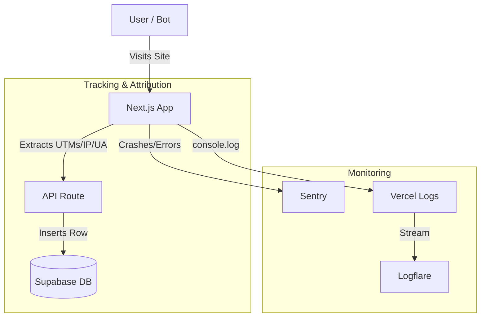

# Logging & Attribution Strategy

**Status:** Planned
**Target Architecture:** Supabase (Business Data) + Sentry (Errors) + Logflare (Runtime Logs)

## 1. Philosophy
For a production site with paid traffic, we need a robust system to answer three questions:
1.  **Revenue:** "Which ad campaign made money?" (Attribution)
2.  **Health:** "Is the site crashing?" (Error Tracking)
3.  **Audit:** "Was that click real?" (Bot Detection)

We adhere to a **"Right Tool for the Job"** approach to keep costs at $0 while maximizing visibility.

## 2. The "Solo Founder" Stack

| Domain | Tool | Role | Why? | Cost |
| :--- | :--- | :--- | :--- | :--- |
| **Business Data** | **Supabase** | Source of Truth | Permanent, queryable SQL for revenue/clicks. | Free (Included) |
| **Application Errors** | **Sentry** | Crash Reporting | Best-in-class error grouping and alerts. | Free Tier available (verify limits) |
| **Runtime Logs** | **Logflare** | History & Debugging | Retains Vercel logs > 1 day. Structured search. | Free Tier available (verify limits) |

---

## 3. Implementation Plan

### Phase 1: Database Schema (Supabase)
We need to enhance our tables to capture the "fingerprint" of every event for bot detection and attribution.

**Migration Workflow:**
1.  Create Migration File:
    ```bash
    touch supabase/migrations/$(date +%Y%m%d%H%M%S)_add_attribution_columns.sql
    ```
2.  **Migration SQL:**
    ```sql
    -- Add attribution columns to clicks table
    ALTER TABLE clicks
      ADD COLUMN user_agent TEXT,
      ADD COLUMN ip_address INET,
      ADD COLUMN utm_source TEXT,
      ADD COLUMN utm_medium TEXT,
      ADD COLUMN utm_campaign TEXT,
      ADD COLUMN fbclid TEXT,
      ADD COLUMN gclid TEXT;

    -- Add indexes for reporting queries
    CREATE INDEX idx_clicks_utm_campaign ON clicks(utm_campaign);
    CREATE INDEX idx_clicks_utm_source ON clicks(utm_source);

    -- Repeat for impressions table
    ALTER TABLE impressions
      ADD COLUMN user_agent TEXT,
      ADD COLUMN ip_address INET,
      ADD COLUMN utm_source TEXT,
      ADD COLUMN utm_medium TEXT,
      ADD COLUMN utm_campaign TEXT,
      ADD COLUMN fbclid TEXT,
      ADD COLUMN gclid TEXT;

    -- Add RLS policies for IP privacy (admin-only access)
    -- Ensure your tables have RLS enabled first
    ```
3.  **Test Locally:**
    ```bash
    supabase start
    supabase migration up
    # Verify columns exist
    supabase db execute "SELECT column_name FROM information_schema.columns WHERE table_name = 'clicks' AND column_name LIKE 'utm%';"
    ```

**Action:** Add columns to `clicks` and `impressions` tables:
*   `user_agent` (text) - *Bot detection*
*   `ip_address` (inet) - *Geographic validation & fraud check. Stored anonymized (last octet zeroed) or hashed for privacy.*
*   `utm_source` (text) - *e.g., "facebook"*
*   `utm_medium` (text) - *e.g., "cpc"*
*   `utm_campaign` (text) - *e.g., "spring_sale"*
*   `fbclid` (text) - *Facebook Click ID*
*   `gclid` (text) - *Google Click ID*

### Phase 2: Code Updates (Attribution)
We need to propagate these parameters from the user's browser to our database.

**Action 1: Update `lib/user-tracking.ts`**
*   Enhance `getUtmParams()` to capture `fbclid` and `gclid`.
*   Ensure these are stored in `sessionStorage` so they persist if the user navigates around before clicking.

**Action 2: Update API Routes**
*   Modify `/api/track-click` and `/api/track-impression`.
*   Extract `User-Agent` and `x-forwarded-for` (IP) from request headers.
    *   *Note:* `x-forwarded-for` can be a list; parse the first valid IP. Treat as "best effort" due to potential spoofing.
*   Accept new UTM parameters in the request body.
*   Insert these values into the Supabase tables.

**Action 3: Update Frontend Tracking**
*   Update `hooks/useClickTracking.ts`, `VehicleCard.tsx`, and `VehicleBridgePage.tsx`.
*   Pass the enhanced UTM data in the API fetch calls.

### Phase 2b: Testing Requirements (CRITICAL)
**Before implementing changes to revenue-critical files:**
1.  Run existing tests: `npm test lib/user-tracking lib/api/track-click`
2.  Update tests **BEFORE** modifying code (TDD workflow).
3.  Verify coverage: `npm run test:coverage` (must maintain **95%+**).
4.  All tests must pass before committing.

*   **Action:** Update `lib/__tests__/user-tracking.test.ts` to cover `fbclid`/`gclid` extraction and sessionStorage persistence.
*   **Action:** Update `app/api/track-click/__tests__/route.test.ts` for new fields (User-Agent, IP, UTM propagation).

### Phase 3: Error Tracking (Sentry)
**Action:**
1.  Install `@sentry/nextjs`.
2.  Run the Sentry wizard (`npx @sentry/wizard -i nextjs`) to auto-configure `next.config.ts` and `sentry.server.config.ts` / `sentry.client.config.ts`.
3.  Verify error capturing by intentionally throwing a test error in a hidden route.

### Phase 4: Rate Limiting Verification
**Action:**
*   Verify that `/api/track-click` and `/api/track-impression` endpoints continue to have rate limiting applied after any payload changes. These are critical endpoints for preventing abuse.

### Phase 5: Runtime Logging (Logflare)
**Action:**
1.  Install the **Logflare Vercel Integration**.
2.  This automatically streams all Vercel function logs (stdout/stderr) to Logflare.
3.  No code changes required for basic functionality.
4.  (Optional) Use `pino-logflare` for structured JSON logging if we need more detail than `console.log`.

---

## 4. Data Flow Diagram



## 5. Success Metrics
*   **Attribution:** We can run a SQL query to see total revenue by `utm_campaign`.
*   **Bot Filter:** We can identify and filter out clicks from `Googlebot` User Agents.
*   **History:** We can view logs from 3 days ago in Logflare (overcoming Vercel's 1-day limit).

## 6. Related Documentation
*   See [`docs/explanation/cookie-tracking.md`](../explanation/cookie-tracking.md) for user tracking architecture.
*   See [`docs/reference/database-schema.md`](../reference/database-schema.md) for current schema details.
*   See [`docs/how-to/create-migration.md`](../how-to/create-migration.md) for database migration workflow.
