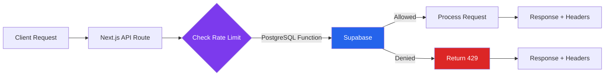

# Rate Limiting Strategy

## Why PostgreSQL Over Redis?

### The Decision

Carzo implements **PostgreSQL-based rate limiting** instead of the traditional Redis approach.

**Reasoning:**
1. **No External Dependencies** - Everything stays in Supabase
2. **No Additional Cost** - Included with Supabase subscription
3. **Sufficient Performance** - Unlogged tables provide ~3x faster writes
4. **Simpler Operations** - One database to manage, not two
5. **No Additional API Keys** - No Redis credentials to rotate

### When Redis Makes Sense

**Redis is better when:**
- Rate limiting needs < 1ms latency
- Handling 10,000+ req/sec sustained traffic
- Using Redis for other purposes (caching, pub/sub)
- Need distributed rate limiting across multiple services

**Our Use Case:**
- Rate limiting needs ~10-50ms latency ✅
- Handling ~100 req/min peak traffic ✅
- No other Redis use cases ✅
- Single Next.js application ✅

**Verdict:** PostgreSQL is sufficient and simpler

## Architecture Overview



## Database Schema

### Unlogged Tables (Performance Optimization)

```sql
-- Unlogged table for rate limit counters (fast writes, no crash recovery)
CREATE UNLOGGED TABLE rate_limits (
  id BIGSERIAL PRIMARY KEY,
  identifier TEXT NOT NULL,           -- IP address or user ID
  endpoint TEXT NOT NULL,              -- API endpoint name
  window_start TIMESTAMPTZ NOT NULL,   -- Window start time
  request_count INTEGER NOT NULL DEFAULT 1,
  created_at TIMESTAMPTZ NOT NULL DEFAULT NOW(),
  updated_at TIMESTAMPTZ NOT NULL DEFAULT NOW(),
  UNIQUE(identifier, endpoint, window_start)
);

-- Index for fast lookups
CREATE INDEX idx_rate_limits_lookup
  ON rate_limits(identifier, endpoint, window_start);

-- Index for cleanup queries
CREATE INDEX idx_rate_limits_created
  ON rate_limits(created_at);
```

**Why Unlogged Tables?**
- **3x faster writes** - Skips Write-Ahead Log (WAL)
- **No crash recovery** - Data lost on crash (acceptable for rate limits)
- **Perfect for ephemeral data** - Rate limits reset anyway

**Trade-off:**
- ❌ Data lost on database crash (but rate limits reset automatically)
- ✅ Much faster writes (critical for rate limiting)
- ✅ Reduced I/O load on database

### Advisory Locks (Race Condition Prevention)

```sql
-- Function: Check and increment rate limit atomically
CREATE FUNCTION check_rate_limit(
  p_identifier TEXT,
  p_endpoint TEXT,
  p_limit INTEGER,
  p_window_seconds INTEGER
) RETURNS TABLE (
  allowed BOOLEAN,
  current_count INTEGER,
  limit_value INTEGER,
  window_reset TIMESTAMPTZ
) AS $$
DECLARE
  v_window_start TIMESTAMPTZ;
  v_current_count INTEGER;
  v_window_reset TIMESTAMPTZ;
BEGIN
  -- Calculate window start (rounded to window_seconds)
  v_window_start := date_trunc('minute', NOW()) -
    (EXTRACT(epoch FROM date_trunc('minute', NOW()))::INTEGER % p_window_seconds) * INTERVAL '1 second';
  v_window_reset := v_window_start + (p_window_seconds * INTERVAL '1 second');

  -- Advisory lock to prevent race conditions
  -- Lock based on hash of identifier + endpoint
  PERFORM pg_advisory_xact_lock(
    hashtext(p_identifier || p_endpoint)
  );

  -- Get or create rate limit record
  INSERT INTO rate_limits (identifier, endpoint, window_start, request_count)
  VALUES (p_identifier, p_endpoint, v_window_start, 1)
  ON CONFLICT (identifier, endpoint, window_start)
  DO UPDATE SET
    request_count = rate_limits.request_count + 1,
    updated_at = NOW()
  RETURNING request_count INTO v_current_count;

  -- Return rate limit status
  RETURN QUERY SELECT
    v_current_count <= p_limit AS allowed,
    v_current_count AS current_count,
    p_limit AS limit_value,
    v_window_reset AS window_reset;
END;
$$ LANGUAGE plpgsql;
```

**How Advisory Locks Work:**
1. Request comes in for identifier + endpoint
2. Hash identifier + endpoint to create lock ID
3. Acquire advisory lock (blocks concurrent requests)
4. Check/increment counter atomically
5. Return result
6. Lock auto-released at transaction end

**Why Advisory Locks?**
- Prevents race conditions (two requests incrementing same counter)
- Lightweight (no table locks)
- Automatic cleanup (transaction-scoped)

## Rate Limit Configuration

### Limit Types

```typescript
// lib/rate-limit.ts
export const RATE_LIMITS = {
  // Per-minute limits (sustained traffic)
  SEARCH_VEHICLES: {
    limit: 100,
    windowSeconds: 60,
  },
  FILTER_OPTIONS: {
    limit: 50,
    windowSeconds: 60,
  },
  TRACK_CLICK: {
    limit: 50,
    windowSeconds: 60,
  },
  TRACK_IMPRESSION: {
    limit: 100,
    windowSeconds: 60,
  },

  // Burst protection (spike traffic)
  BURST: {
    limit: 10,
    windowSeconds: 1,
  },

  // Session limits (hourly)
  SESSION: {
    limit: 500,
    windowSeconds: 3600,
  },
};
```

### Multi-Tier Rate Limiting

**Strategy:** Apply multiple limits to same endpoint

**Example:** Search endpoint has 3 limits:
1. **Per-minute:** 100 requests/min (sustained traffic)
2. **Burst:** 10 requests/sec (spike protection)
3. **Session:** 500 requests/hour (abuse prevention)

**Implementation:**
```typescript
// Check multiple limits
const rateLimitResult = await checkMultipleRateLimits(identifier, [
  { endpoint: 'search_vehicles', ...RATE_LIMITS.SEARCH_VEHICLES },
  { endpoint: 'search_vehicles_burst', ...RATE_LIMITS.BURST },
  { endpoint: 'search_vehicles_session', ...RATE_LIMITS.SESSION },
]);

if (!rateLimitResult.allowed) {
  return NextResponse.json({ error: 'Rate limit exceeded' }, { status: 429 });
}
```

**Why Multi-Tier?**
- Catches different abuse patterns
- Burst limit prevents sudden spikes
- Session limit prevents sustained scraping
- Per-minute limit balances normal usage

## Client Identification

### Priority Order

1. **User ID (Cookie)** - Best (persistent across IPs)
2. **IP Address** - Fallback (shared IPs problematic)
3. **Combination** - User ID + IP (future enhancement)

### Implementation

```typescript
// lib/rate-limit.ts
export function getClientIdentifier(request: NextRequest): string {
  // Try to get user ID from cookie
  const userId = request.cookies.get('carzo_user_id')?.value;
  if (userId) {
    return `user:${userId}`;
  }

  // Fallback to IP address
  const forwardedFor = request.headers.get('x-forwarded-for');
  const ip = forwardedFor?.split(',')[0] || request.ip || 'unknown';
  return `ip:${ip}`;
}
```

### Edge Cases

**Shared IPs (Corporate Networks, VPNs):**
- Problem: One user's abuse blocks entire office
- Solution: User ID takes priority over IP
- Fallback: Manual whitelist for known corporate IPs (future)

**Missing Cookies:**
- Problem: User hasn't accepted cookies yet
- Solution: Fall back to IP-based rate limiting
- Impact: Less accurate, but prevents abuse

**IP Spoofing:**
- Problem: Attacker rotates IPs to bypass limits
- Solution: User ID tracking catches this (cookie-based)
- Additional: Monitor for patterns (same user agent, same search queries)

## Performance Characteristics

### Latency Benchmarks

**PostgreSQL Rate Limit Check:**
- Cold start: ~50ms
- Warm cache: ~10-15ms
- p95: ~20ms
- p99: ~30ms

**Redis Rate Limit Check (for comparison):**
- Cold start: ~2ms
- Warm cache: ~0.5-1ms
- p95: ~2ms
- p99: ~5ms

**Impact on API Response Time:**
- Total API time: 100-200ms (PostGIS query dominates)
- Rate limit check: 10-20ms (10-20% overhead)
- Acceptable trade-off for simpler architecture

### Throughput

**PostgreSQL Unlogged Tables:**
- Writes: ~10,000 TPS (transactions per second)
- Reads: ~50,000 TPS
- Our traffic: ~100 requests/min peak (~2 TPS)

**Headroom:** 5,000x capacity above current usage

### Database Load

**Rate Limit Queries:**
- CPU: < 1% of total database load
- Memory: < 10 MB (unlogged table is lightweight)
- I/O: Minimal (no WAL writes)

**Not a Bottleneck:** PostGIS spatial queries use 100x more resources

## API Response Headers

### Standard Rate Limit Headers

```typescript
// All rate-limited endpoints return these headers
return NextResponse.json(data, {
  status: 200,
  headers: {
    'X-RateLimit-Limit': '100',              // Max requests per window
    'X-RateLimit-Remaining': '87',            // Remaining in current window
    'X-RateLimit-Reset': '2025-11-12T10:45:00Z', // Window reset time (ISO 8601)
  },
});
```

### 429 Response Format

```typescript
// Rate limit exceeded response
return NextResponse.json(
  {
    error: 'Rate limit exceeded',
    message: 'You have exceeded the rate limit. Please try again later.',
    retryAfter: 45, // Seconds until reset
  },
  {
    status: 429,
    headers: {
      'Retry-After': '45',                     // Seconds (HTTP standard)
      'X-RateLimit-Limit': '100',
      'X-RateLimit-Remaining': '0',
      'X-RateLimit-Reset': '2025-11-12T10:45:00Z',
    },
  }
);
```

### Client Usage

**JavaScript Example:**
```typescript
const response = await fetch('/api/search-vehicles', {
  method: 'POST',
  body: JSON.stringify({ make: 'Toyota' }),
});

// Check rate limit headers
const limit = response.headers.get('X-RateLimit-Limit');
const remaining = response.headers.get('X-RateLimit-Remaining');
const reset = response.headers.get('X-RateLimit-Reset');

if (response.status === 429) {
  const retryAfter = response.headers.get('Retry-After');
  console.log(`Rate limited. Retry after ${retryAfter} seconds`);
  // Show user-friendly message
}
```

## Maintenance & Cleanup

### Automatic Cleanup Function

```sql
-- Function: Delete rate limit records older than 24 hours
CREATE FUNCTION cleanup_rate_limits()
RETURNS INTEGER AS $$
DECLARE
  deleted_count INTEGER;
BEGIN
  -- Delete records older than 24 hours
  DELETE FROM rate_limits
  WHERE created_at < NOW() - INTERVAL '24 hours';

  GET DIAGNOSTICS deleted_count = ROW_COUNT;
  RETURN deleted_count;
END;
$$ LANGUAGE plpgsql;
```

### Cron Job Schedule

**Vercel Cron Configuration** (`vercel.json`):
```json
{
  "crons": [
    {
      "path": "/api/cron/cleanup-rate-limits",
      "schedule": "0 * * * *"
    }
  ]
}
```

**Schedule:** Every hour at :00 minutes

**API Endpoint:** `/api/cron/cleanup-rate-limits`
```typescript
// app/api/cron/cleanup-rate-limits/route.ts
export async function GET(request: NextRequest) {
  // Verify cron secret
  const authHeader = request.headers.get('authorization');
  if (authHeader !== `Bearer ${process.env.CRON_SECRET}`) {
    return NextResponse.json({ error: 'Unauthorized' }, { status: 401 });
  }

  // Call cleanup function
  const { data, error } = await supabase.rpc('cleanup_rate_limits');

  if (error) {
    return NextResponse.json({ error: error.message }, { status: 500 });
  }

  return NextResponse.json({
    success: true,
    deletedRecords: data,
    timestamp: new Date().toISOString(),
  });
}
```

### Why 24 Hours?

- **Rate limits reset in 1 hour max** (longest window)
- **Keep 24 hours for analytics** (review patterns)
- **Balance storage vs insights** (< 100 MB table size)

## Monitoring & Alerts

### Key Metrics to Track

**Rate Limit Hits:**
```sql
-- Count 429 responses in last hour
SELECT COUNT(*)
FROM rate_limits
WHERE created_at > NOW() - INTERVAL '1 hour'
  AND request_count > (
    SELECT limit FROM rate_limit_config WHERE endpoint = rate_limits.endpoint
  );
```

**Top Rate-Limited IPs:**
```sql
-- IPs hitting rate limits most often
SELECT
  identifier,
  COUNT(*) as limit_hits,
  MAX(request_count) as peak_requests
FROM rate_limits
WHERE created_at > NOW() - INTERVAL '24 hours'
  AND request_count > 100
GROUP BY identifier
ORDER BY limit_hits DESC
LIMIT 10;
```

**Endpoint Usage:**
```sql
-- Requests per endpoint in last hour
SELECT
  endpoint,
  COUNT(*) as total_requests,
  AVG(request_count) as avg_requests_per_window
FROM rate_limits
WHERE created_at > NOW() - INTERVAL '1 hour'
GROUP BY endpoint
ORDER BY total_requests DESC;
```

### Alert Thresholds

**Create Alerts When:**
1. Single IP exceeds rate limit 10+ times in 1 hour (possible bot)
2. Rate limit table size > 500 MB (cleanup not working)
3. Rate limit check latency p95 > 50ms (database overload)
4. 429 responses > 5% of total requests (limits too strict)

## Testing Rate Limits

### Manual Testing

**Apache Bench (ab):**
```bash
# Test with 100 requests, 10 concurrent
ab -n 100 -c 10 \
   -H "Content-Type: application/json" \
   -p payload.json \
   https://carzo.net/api/search-vehicles

# Should see HTTP 429 responses after hitting limit
```

**curl with loop:**
```bash
# Rapid-fire 20 requests
for i in {1..20}; do
  curl -X POST https://carzo.net/api/search-vehicles \
    -H "Content-Type: application/json" \
    -d '{"make":"Toyota"}' \
    -w "Status: %{http_code}\n" \
    -o /dev/null -s
done

# Should see 200 responses, then 429 after limit
```

### Unit Tests

```typescript
// lib/__tests__/rate-limit.test.ts
describe('Rate Limiting', () => {
  it('should allow requests within limit', async () => {
    const identifier = 'test-user-1';

    for (let i = 0; i < 10; i++) {
      const result = await checkRateLimit(identifier, 'test_endpoint', 10, 60);
      expect(result.allowed).toBe(true);
    }
  });

  it('should block requests exceeding limit', async () => {
    const identifier = 'test-user-2';

    // First 10 requests allowed
    for (let i = 0; i < 10; i++) {
      await checkRateLimit(identifier, 'test_endpoint', 10, 60);
    }

    // 11th request blocked
    const result = await checkRateLimit(identifier, 'test_endpoint', 10, 60);
    expect(result.allowed).toBe(false);
  });

  it('should reset after window expires', async () => {
    const identifier = 'test-user-3';

    // Exhaust limit
    for (let i = 0; i < 10; i++) {
      await checkRateLimit(identifier, 'test_endpoint', 10, 60);
    }

    // Wait for window to expire (mock time)
    jest.advanceTimersByTime(61000);

    // Should allow again
    const result = await checkRateLimit(identifier, 'test_endpoint', 10, 60);
    expect(result.allowed).toBe(true);
  });
});
```

## Security Considerations

### Bypass Attempts

**IP Rotation:**
- Problem: Attacker uses proxy pool to rotate IPs
- Mitigation: User ID tracking catches persistent attackers
- Additional: Pattern detection (same search queries, user agent)

**Cookie Deletion:**
- Problem: Attacker deletes cookies to get new user ID
- Mitigation: IP-based rate limiting still applies
- Additional: Fingerprinting (future) can detect same browser

**Distributed Attacks:**
- Problem: Botnet with thousands of unique IPs
- Mitigation: Cloudflare/Vercel DDoS protection (upstream)
- Additional: Monitor for unusual traffic patterns

### False Positives

**Shared Corporate IPs:**
- Problem: Entire office shares one IP
- Solution: User ID tracking provides individual limits
- Fallback: Manual IP whitelist (rare cases)

**Aggressive Legitimate Users:**
- Problem: Power user legitimately makes 100+ searches
- Solution: Session limits are generous (500/hour)
- Option: Premium tier with higher limits (future)

## When to Adjust Limits

### Signs Limits Are Too Strict

1. **High 429 rate** (> 5% of requests)
2. **User complaints** about being blocked
3. **Drop in conversion** after implementing rate limits

**Action:** Increase limits by 50%, monitor for 1 week

### Signs Limits Are Too Loose

1. **Database CPU spikes** (rate limits not protecting)
2. **Scraping detected** (systematic data extraction)
3. **Costs increasing** without revenue increase

**Action:** Decrease limits by 30%, monitor for abuse patterns

### A/B Testing Rate Limits

**Experiment:**
1. Group A: Current limits (100/min)
2. Group B: Stricter limits (50/min)
3. Measure: Conversion rate, bounce rate, 429 rate

**Goal:** Find optimal balance between protection and user experience

---

**Related Documentation:**
- [Architecture Overview](./architecture-overview.md) - Where rate limiting fits
- [API Reference](../reference/api/) - Rate limits for each endpoint
- [PostgreSQL Spatial Queries](./postgis-spatial-queries.md) - PostGIS performance optimization
