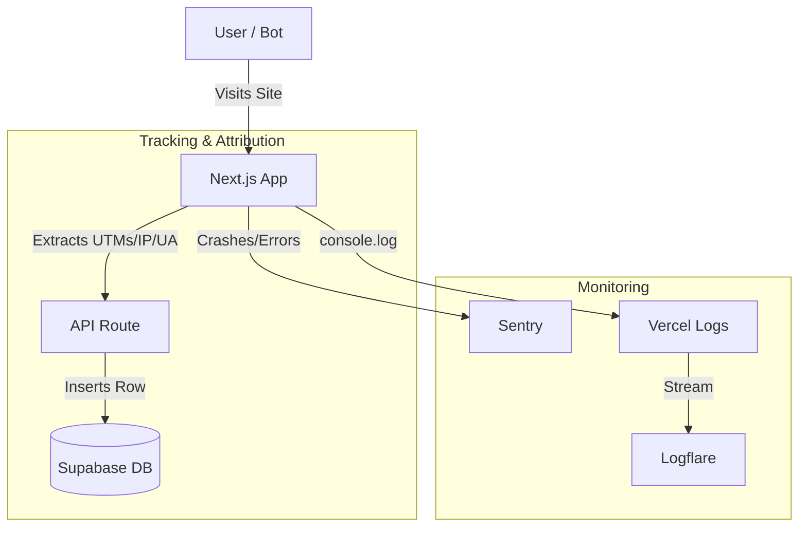

# Logging & Attribution Strategy

**Status:** Planned
**Target Architecture:** Supabase (Business Data) + Sentry (Errors) + Logflare (Runtime Logs)

## 1. Philosophy
For a production site with paid traffic, we need a robust system to answer three questions:
1.  **Revenue:** "Which ad campaign made money?" (Attribution)
2.  **Health:** "Is the site crashing?" (Error Tracking)
3.  **Audit:** "Was that click real?" (Bot Detection)

We adhere to a **"Right Tool for the Job"** approach to keep costs at $0 while maximizing visibility.

## 2. The "Solo Founder" Stack

| Domain | Tool | Role | Why? | Cost |
| :--- | :--- | :--- | :--- | :--- |
| **Business Data** | **Supabase** | Source of Truth | Permanent, queryable SQL for revenue/clicks. | Free (Included) |
| **Application Errors** | **Sentry** | Crash Reporting | Best-in-class error grouping and alerts. | Free Tier |
| **Runtime Logs** | **Logflare** | History & Debugging | Retains Vercel logs > 1 day. Structured search. | Free Tier |

---

## 3. Implementation Plan

### Phase 1: Database Schema (Supabase)
We need to enhance our tables to capture the "fingerprint" of every event for bot detection and attribution.

**Action:** Add columns to `clicks` and `impressions` tables:
*   `user_agent` (text) - *Bot detection*
*   `ip_address` (inet) - *Geographic validation & fraud check. Stored anonymized (last octet zeroed) or hashed for privacy.*
*   `utm_source` (text) - *e.g., "facebook"*
*   `utm_medium` (text) - *e.g., "cpc"*
*   `utm_campaign` (text) - *e.g., "spring_sale"*
*   `fbclid` (text) - *Facebook Click ID*
*   `gclid` (text) - *Google Click ID*

### Phase 2: Code Updates (Attribution)
We need to propagate these parameters from the user's browser to our database.

**Action 1: Update `lib/user-tracking.ts`**
*   Enhance `getUtmParams()` to capture `fbclid` and `gclid`.
*   Ensure these are stored in `sessionStorage` so they persist if the user navigates around before clicking.

**Action 2: Update API Routes**
*   Modify `/api/track-click` and `/api/track-impression`.
*   Extract `User-Agent` and `x-forwarded-for` (IP) from request headers.
    *   *Note:* `x-forwarded-for` can be a list; parse the first valid IP. Treat as "best effort" due to potential spoofing.
*   Accept new UTM parameters in the request body.
*   Insert these values into the Supabase tables.

**Action 3: Update Frontend Tracking**
*   Update `hooks/useClickTracking.ts`, `VehicleCard.tsx`, and `VehicleBridgePage.tsx`.
*   Pass the enhanced UTM data in the API fetch calls.

### Phase 3: Error Tracking (Sentry)
**Action:**
1.  Install `@sentry/nextjs`.
2.  Run the Sentry wizard (`npx @sentry/wizard -i nextjs`) to auto-configure `next.config.ts` and `sentry.server.config.ts` / `sentry.client.config.ts`.
3.  Verify error capturing by intentionally throwing a test error in a hidden route.

### Phase 4: Runtime Logging (Logflare)
**Action:**
1.  Install the **Logflare Vercel Integration**.
2.  This automatically streams all Vercel function logs (stdout/stderr) to Logflare.
3.  No code changes required for basic functionality.
4.  (Optional) Use `pino-logflare` for structured JSON logging if we need more detail than `console.log`.

---

## 4. Data Flow Diagram

## 5. Success Metrics
*   **Attribution:** We can run a SQL query to see total revenue by `utm_campaign`.
*   **Bot Filter:** We can identify and filter out clicks from `Googlebot` User Agents.
*   **History:** We can view logs from 3 days ago in Logflare (overcoming Vercel's 1-day limit).
