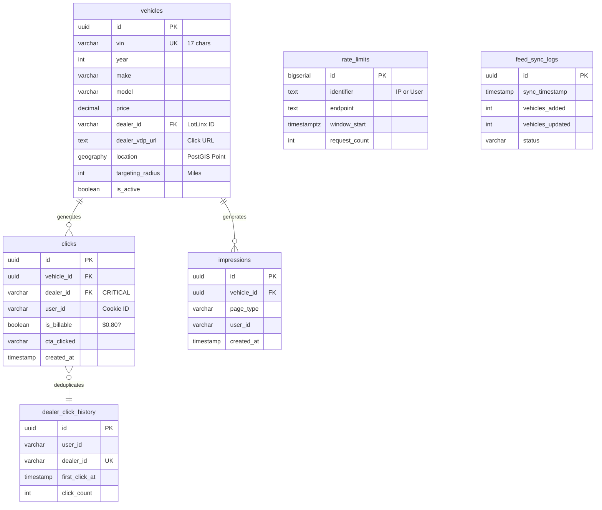

# Database Schema Reference

## Overview

Carzo uses **Supabase (PostgreSQL 15+)** with **PostGIS extension** for spatial queries. The schema is optimized for the business model: **$0.80 per unique dealer click per user per 30 days**.

**Key Features:**
- Denormalized design for read performance
- PostGIS GEOGRAPHY for 100x faster location-based search
- GIST spatial indexes for radius queries
- Rate limiting with unlogged tables
- Row-Level Security (RLS) policies
- Dealer diversification via indexes

## Entity Relationship Diagram



## Core Tables

### vehicles

Main inventory table with 72K+ vehicles from LotLinx feed. **Denormalized** design includes dealer info for faster joins.

**Schema:**

| Column | Type | Constraints | Description |
|--------|------|-------------|-------------|
| `id` | UUID | PK, Default uuid_generate_v4() | Primary key |
| `vin` | VARCHAR(17) | UNIQUE, NOT NULL | Vehicle VIN (unique identifier) |
| **Display Info** | | | |
| `year` | INT | NOT NULL | Model year (2015-2025) |
| `make` | VARCHAR(50) | NOT NULL | Manufacturer (Toyota, Honda, etc.) |
| `model` | VARCHAR(50) | NOT NULL | Model name (Camry, Accord, etc.) |
| `trim` | VARCHAR(100) | | Trim level (SE, EX, Limited, etc.) |
| `price` | DECIMAL(10,2) | NOT NULL | List price in USD |
| `miles` | INT | | Odometer reading |
| `condition` | VARCHAR(20) | | 'new', 'used', 'cpo' (certified pre-owned) |
| `body_style` | VARCHAR(50) | | Sedan, SUV, Truck, etc. |
| **Images** | | | |
| `primary_image_url` | TEXT | NOT NULL | CDN URL for main photo |
| `total_photos` | INT | Default 15 | Total photo count (for "+X More") |
| **Specs** | | | |
| `transmission` | VARCHAR(50) | | Automatic, Manual, CVT |
| `fuel_type` | VARCHAR(50) | | Gasoline, Diesel, Hybrid, Electric |
| `drive_type` | VARCHAR(20) | | FWD, RWD, AWD, 4WD |
| `exterior_color` | VARCHAR(50) | | Exterior color |
| `interior_color` | VARCHAR(50) | | Interior color |
| `mpg_city` | INT | | City fuel economy |
| `mpg_highway` | INT | | Highway fuel economy |
| `doors` | INT | | Number of doors (2, 4) |
| `cylinders` | INT | | Engine cylinders (4, 6, 8) |
| **Description** | | | |
| `description` | TEXT | | Vehicle description |
| `features` | TEXT[] | | Array of feature strings |
| `options` | TEXT | | Additional options |
| **Dealer Info (CRITICAL)** | | | |
| `dealer_id` | VARCHAR(50) | NOT NULL, **Indexed** | LotLinx dealer ID (for deduplication) |
| `dealer_name` | VARCHAR(255) | NOT NULL | Dealership name |
| `dealer_address` | VARCHAR(255) | | Street address |
| `dealer_city` | VARCHAR(100) | | City |
| `dealer_state` | VARCHAR(2) | | State code (GA, CA, etc.) |
| `dealer_zip` | VARCHAR(5) | | 5-digit zip code |
| `dealer_vdp_url` | TEXT | NOT NULL | LotLinx click URL (with tracking) |
| **Location (PostGIS)** | | | |
| `latitude` | DECIMAL(10,7) | | Dealer latitude |
| `longitude` | DECIMAL(10,7) | | Dealer longitude |
| `location` | GEOGRAPHY(Point, 4326) | **GIST indexed** | PostGIS geographic point (auto-populated from lat/lon) |
| `targeting_radius` | INT | Default 30 | Search radius in miles (from feed) |
| **Metadata** | | | |
| `is_active` | BOOLEAN | Default true | Whether vehicle is available in feed |
| `last_sync` | TIMESTAMP | Default NOW() | Last feed sync timestamp |
| `created_at` | TIMESTAMP | Default NOW() | Record creation timestamp |

**Indexes:**

```sql
-- Search performance
CREATE INDEX idx_make ON vehicles(make);
CREATE INDEX idx_model ON vehicles(model);
CREATE INDEX idx_body_style ON vehicles(body_style);
CREATE INDEX idx_price ON vehicles(price);
CREATE INDEX idx_condition ON vehicles(condition);
CREATE INDEX idx_year ON vehicles(year);
CREATE INDEX idx_is_active ON vehicles(is_active);
CREATE INDEX idx_vin ON vehicles(vin);

-- CRITICAL: Dealer diversification indexes
CREATE INDEX idx_dealer ON vehicles(dealer_id);
CREATE INDEX idx_dealer_make ON vehicles(dealer_id, make);

-- Composite indexes for common queries
CREATE INDEX idx_search_combo ON vehicles(make, model, body_style, is_active);
CREATE INDEX idx_active_make ON vehicles(is_active, make) WHERE is_active = true;

-- PostGIS spatial index (THE MAGIC - 100x faster)
CREATE INDEX idx_vehicles_location_gist ON vehicles USING GIST(location);
CREATE INDEX idx_vehicles_active_location ON vehicles(is_active) WHERE is_active = true;
```

**Row-Level Security (RLS):**

```sql
-- Public can only view active vehicles
ALTER TABLE vehicles ENABLE ROW LEVEL SECURITY;

CREATE POLICY "Public can view active vehicles"
  ON vehicles FOR SELECT
  USING (is_active = true);

-- Only service role can modify vehicles
CREATE POLICY "Service role can manage vehicles"
  ON vehicles FOR ALL
  USING (auth.role() = 'service_role');
```

**Comments:**

```sql
COMMENT ON TABLE vehicles IS 'Main inventory of vehicles from LotLinx feed';
COMMENT ON COLUMN vehicles.dealer_id IS 'LotLinx dealer ID - critical for revenue deduplication';
COMMENT ON COLUMN vehicles.location IS 'PostGIS GEOGRAPHY point for spatial queries. Auto-populated from latitude/longitude.';
```

---

### clicks

Tracks all dealer click-through events with deduplication for billable revenue calculation.

**Schema:**

| Column | Type | Constraints | Description |
|--------|------|-------------|-------------|
| `id` | UUID | PK, Default uuid_generate_v4() | Primary key |
| `vehicle_id` | UUID | FK → vehicles(id), NOT NULL | Which vehicle was clicked |
| `dealer_id` | VARCHAR(50) | NOT NULL, **Indexed** | LotLinx dealer ID (CRITICAL for deduplication) |
| `user_id` | VARCHAR(255) | NOT NULL, **Indexed** | Cookie-based user ID |
| `session_id` | VARCHAR(255) | | Session ID (per-tab) |
| **Deduplication** | | | |
| `is_billable` | BOOLEAN | Default true | TRUE if first click to this dealer in 30 days ($0.80 revenue) |
| **Click Details** | | | |
| `cta_clicked` | VARCHAR(50) | | 'primary', 'history', 'payment', 'description', 'serp_direct' |
| `flow` | VARCHAR(20) | | 'full', 'direct', 'vdp-only' (A/B test variant) |
| `utm_source` | VARCHAR(50) | | UTM source (facebook, google) |
| `utm_medium` | VARCHAR(50) | | UTM medium (cpc, display) |
| `utm_campaign` | VARCHAR(100) | | UTM campaign name |
| `created_at` | TIMESTAMP | Default NOW(), **Indexed** | Click timestamp |

**Indexes:**

```sql
CREATE INDEX idx_clicks_dealer ON clicks(dealer_id);
CREATE INDEX idx_clicks_user ON clicks(user_id, created_at);
CREATE INDEX idx_clicks_billable ON clicks(is_billable);
CREATE INDEX idx_clicks_vehicle ON clicks(vehicle_id);
CREATE INDEX idx_clicks_created ON clicks(created_at);
CREATE INDEX idx_clicks_flow ON clicks(flow);
```

**Row-Level Security:**

```sql
ALTER TABLE clicks ENABLE ROW LEVEL SECURITY;

CREATE POLICY "Anyone can insert clicks"
  ON clicks FOR INSERT
  WITH CHECK (true);
```

**Comments:**

```sql
COMMENT ON TABLE clicks IS 'Tracks all click-throughs to dealer VDPs with deduplication';
COMMENT ON COLUMN clicks.is_billable IS 'TRUE if this is first click to this dealer by this user in 30 days ($0.80 revenue)';
```

---

### dealer_click_history

Tracks unique dealer clicks per user within a 30-day window. Used to mark subsequent clicks as non-billable.

**Schema:**

| Column | Type | Constraints | Description |
|--------|------|-------------|-------------|
| `id` | UUID | PK, Default uuid_generate_v4() | Primary key |
| `user_id` | VARCHAR(255) | NOT NULL, **Indexed** | Cookie-based user ID |
| `dealer_id` | VARCHAR(50) | NOT NULL, **Indexed** | LotLinx dealer ID |
| `first_click_at` | TIMESTAMP | NOT NULL, **Indexed** | First click to this dealer (30-day window starts) |
| `last_click_at` | TIMESTAMP | NOT NULL | Most recent click to this dealer |
| `click_count` | INT | Default 1 | Total click count (informational) |
| **Unique Constraint** | | UNIQUE(user_id, dealer_id) | One row per user-dealer pair |

**Indexes:**

```sql
CREATE INDEX idx_history_user ON dealer_click_history(user_id);
CREATE INDEX idx_history_dealer ON dealer_click_history(dealer_id);
CREATE INDEX idx_history_expires ON dealer_click_history(first_click_at);
```

**Row-Level Security:**

```sql
ALTER TABLE dealer_click_history ENABLE ROW LEVEL SECURITY;

CREATE POLICY "Anyone can manage dealer history"
  ON dealer_click_history FOR ALL
  WITH CHECK (true);
```

**Comments:**

```sql
COMMENT ON TABLE dealer_click_history IS 'Tracks unique dealer clicks per user (30-day window) for revenue calculation';
```

**Cleanup Query** (remove expired records):

```sql
-- Delete records older than 30 days (past revenue window)
DELETE FROM dealer_click_history
WHERE first_click_at < NOW() - INTERVAL '30 days';
```

---

### impressions

Tracks vehicle page views for CTR (Click-Through Rate) calculation.

**Schema:**

| Column | Type | Constraints | Description |
|--------|------|-------------|-------------|
| `id` | UUID | PK, Default uuid_generate_v4() | Primary key |
| `vehicle_id` | UUID | FK → vehicles(id), NOT NULL, **Indexed** | Which vehicle was viewed |
| `page_type` | VARCHAR(20) | | 'search', 'homepage', 'direct' |
| `flow` | VARCHAR(20) | | 'full', 'direct', 'vdp-only' (A/B test variant) |
| `user_id` | VARCHAR(255) | | Cookie-based user ID |
| `session_id` | VARCHAR(255) | | Session ID (per-tab) |
| `created_at` | TIMESTAMP | Default NOW(), **Indexed** | Impression timestamp |

**Indexes:**

```sql
CREATE INDEX idx_impressions_vehicle ON impressions(vehicle_id);
CREATE INDEX idx_impressions_created ON impressions(created_at);
CREATE INDEX idx_impressions_flow ON impressions(flow);
```

**Row-Level Security:**

```sql
ALTER TABLE impressions ENABLE ROW LEVEL SECURITY;

CREATE POLICY "Anyone can insert impressions"
  ON impressions FOR INSERT
  WITH CHECK (true);
```

**Comments:**

```sql
COMMENT ON TABLE impressions IS 'Tracks vehicle page views for CTR calculation';
```

**CTR Calculation Query:**

```sql
-- Calculate CTR by flow variant
SELECT
  i.flow,
  COUNT(DISTINCT i.id) as impressions,
  COUNT(DISTINCT c.id) as clicks,
  (COUNT(DISTINCT c.id)::FLOAT / NULLIF(COUNT(DISTINCT i.id), 0) * 100) as ctr_percent
FROM impressions i
LEFT JOIN clicks c ON i.vehicle_id = c.vehicle_id AND i.flow = c.flow
WHERE i.created_at >= NOW() - INTERVAL '7 days'
GROUP BY i.flow;
```

---

### rate_limits

Unlogged table for PostgreSQL-based rate limiting (3x faster than regular tables).

**Schema:**

| Column | Type | Constraints | Description |
|--------|------|-------------|-------------|
| `id` | BIGSERIAL | PK | Auto-increment primary key |
| `identifier` | TEXT | NOT NULL, **Indexed** | IP address or user ID |
| `endpoint` | TEXT | NOT NULL, **Indexed** | API endpoint name ('search_vehicles', etc.) |
| `window_start` | TIMESTAMPTZ | NOT NULL, **Indexed** | Rate limit window start time |
| `request_count` | INTEGER | NOT NULL, Default 1 | Number of requests in this window |
| `created_at` | TIMESTAMPTZ | NOT NULL, Default NOW() | Record creation timestamp |
| `updated_at` | TIMESTAMPTZ | NOT NULL, Default NOW() | Last update timestamp |
| **Unique Constraint** | | UNIQUE(identifier, endpoint, window_start) | One row per identifier-endpoint-window tuple |

**Table Type: UNLOGGED**

```sql
-- Unlogged tables skip Write-Ahead Log (WAL)
-- ~3x faster writes, acceptable data loss risk for rate limiting
CREATE UNLOGGED TABLE rate_limits (...);
```

**Indexes:**

```sql
CREATE INDEX idx_rate_limits_identifier ON rate_limits(identifier);
CREATE INDEX idx_rate_limits_endpoint ON rate_limits(endpoint);
CREATE INDEX idx_rate_limits_window ON rate_limits(window_start);
CREATE INDEX idx_rate_limits_created ON rate_limits(created_at);
```

**Cleanup Function:**

```sql
-- Function: Delete rate limit records older than 24 hours
CREATE FUNCTION cleanup_rate_limits() RETURNS INTEGER AS $$
DECLARE
  deleted_count INTEGER;
BEGIN
  DELETE FROM rate_limits WHERE created_at < NOW() - INTERVAL '24 hours';
  GET DIAGNOSTICS deleted_count = ROW_COUNT;
  RETURN deleted_count;
END;
$$ LANGUAGE plpgsql;
```

**Usage Example:**

See [Rate Limiting Strategy](../explanation/rate-limiting-strategy.md) for complete implementation.

---

### feed_sync_logs

Tracks LotLinx feed synchronization history (4x daily).

**Schema:**

| Column | Type | Constraints | Description |
|--------|------|-------------|-------------|
| `id` | UUID | PK, Default uuid_generate_v4() | Primary key |
| `sync_timestamp` | TIMESTAMP | Default NOW(), **Indexed** | When sync started |
| `vehicles_added` | INT | Default 0 | New vehicles added |
| `vehicles_updated` | INT | Default 0 | Existing vehicles updated |
| `vehicles_removed` | INT | Default 0 | Vehicles marked inactive |
| `total_vehicles` | INT | | Total active vehicles after sync |
| `duration_seconds` | INT | | Sync duration |
| `status` | VARCHAR(20) | Default 'success' | 'success', 'partial', 'failed' |
| `error_message` | TEXT | | Error details if failed |
| `created_at` | TIMESTAMP | Default NOW() | Record creation timestamp |

**Indexes:**

```sql
CREATE INDEX idx_sync_timestamp ON feed_sync_logs(sync_timestamp);
```

**Usage:**

Inserted by `/api/cron/sync-feed` endpoint after each sync run.

---

## PostGIS Spatial Functions

### search_vehicles_by_location

Returns vehicles within their `targeting_radius` of the user's location, sorted by distance.

**Function Signature:**

```sql
CREATE OR REPLACE FUNCTION search_vehicles_by_location(
  user_lat DOUBLE PRECISION,
  user_lon DOUBLE PRECISION,
  p_make TEXT DEFAULT NULL,
  p_model TEXT DEFAULT NULL,
  p_condition TEXT DEFAULT NULL,
  p_body_style TEXT DEFAULT NULL,
  p_min_price NUMERIC DEFAULT NULL,
  p_max_price NUMERIC DEFAULT NULL,
  p_min_year INTEGER DEFAULT NULL,
  p_max_year INTEGER DEFAULT NULL,
  p_limit INTEGER DEFAULT 1000,
  p_offset INTEGER DEFAULT 0
)
RETURNS TABLE (
  id UUID,
  vin VARCHAR(17),
  year INTEGER,
  make VARCHAR(100),
  model VARCHAR(100),
  trim VARCHAR(100),
  price NUMERIC(10,2),
  miles INTEGER,
  -- ... all vehicle columns ...
  distance_miles DOUBLE PRECISION,
  total_results BIGINT
);
```

**Usage:**

```sql
-- Search for Toyota Camrys near Atlanta within 50 miles
SELECT * FROM search_vehicles_by_location(
  user_lat := 33.7490,
  user_lon := -84.3880,
  p_make := 'Toyota',
  p_model := 'Camry',
  p_limit := 100
);
```

**Key Features:**

- Uses PostGIS `ST_DWithin()` for fast spatial filtering (GIST index)
- Calculates distance in miles using `ST_Distance()`
- Filters by targeting_radius (vehicle-specific search radius)
- Caps maximum radius at 100 miles (min of targeting_radius and 100)
- Returns `total_results` window function for pagination
- Orders by distance (nearest first)

**Performance:**

- Query time: ~50-100ms (with GIST index)
- Old approach (no PostGIS): 3-5 seconds (10K records in JS)
- **100x faster**

See [PostGIS Spatial Queries](../explanation/postgis-spatial-queries.md) for implementation details.

---

### get_filter_options_by_location

Returns distinct filter options (makes, models, conditions, etc.) for vehicles within user's location.

**Function Signature:**

```sql
CREATE OR REPLACE FUNCTION get_filter_options_by_location(
  user_lat DOUBLE PRECISION,
  user_lon DOUBLE PRECISION,
  p_make TEXT DEFAULT NULL
)
RETURNS TABLE (
  makes TEXT[],
  models TEXT[],
  conditions TEXT[],
  body_styles TEXT[],
  min_price NUMERIC(10,2),
  max_price NUMERIC(10,2),
  min_year INTEGER,
  max_year INTEGER,
  total_count BIGINT
);
```

**Usage:**

```sql
-- Get filter options for Toyota vehicles near user
SELECT * FROM get_filter_options_by_location(
  user_lat := 33.7490,
  user_lon := -84.3880,
  p_make := 'Toyota'
);
```

**Returns:**

```json
{
  "makes": ["Toyota", "Honda", "Ford", ...],
  "models": ["Camry", "Accord", "F-150", ...],
  "conditions": ["new", "used", "cpo"],
  "body_styles": ["Sedan", "SUV", "Truck"],
  "min_price": 15000,
  "max_price": 85000,
  "min_year": 2015,
  "max_year": 2025,
  "total_count": 1523
}
```

---

### update_vehicle_location (Trigger Function)

Automatically updates the `location` GEOGRAPHY column from `latitude` and `longitude` on INSERT/UPDATE.

**Function:**

```sql
CREATE OR REPLACE FUNCTION update_vehicle_location()
RETURNS TRIGGER AS $$
BEGIN
  IF NEW.latitude IS NOT NULL AND NEW.longitude IS NOT NULL THEN
    NEW.location = ST_SetSRID(
      ST_MakePoint(NEW.longitude, NEW.latitude),
      4326
    )::geography;
  END IF;
  RETURN NEW;
END;
$$ LANGUAGE plpgsql;
```

**Trigger:**

```sql
CREATE TRIGGER trg_update_vehicle_location
  BEFORE INSERT OR UPDATE OF latitude, longitude
  ON vehicles
  FOR EACH ROW
  EXECUTE FUNCTION update_vehicle_location();
```

**Why This Matters:**

- Keeps `location` column in sync with lat/lon
- No manual updates needed
- Ensures spatial index always has fresh data
- Runs automatically on INSERT/UPDATE

---

## Revenue Calculation Query

**Get billable clicks (unique dealers only):**

```sql
-- Revenue = billable clicks × $0.80
SELECT
  COUNT(*) FILTER (WHERE is_billable = true) as billable_clicks,
  COUNT(*) FILTER (WHERE is_billable = false) as wasted_clicks,
  COUNT(*) as total_clicks,
  (COUNT(*) FILTER (WHERE is_billable = true) * 0.80) as revenue
FROM clicks
WHERE created_at >= NOW() - INTERVAL '30 days';
```

**Output:**

```
billable_clicks | wasted_clicks | total_clicks | revenue
----------------+---------------+--------------+---------
          1,234 |           456 |        1,690 | $987.20
```

---

## Common Queries

### Find Vehicles Near Location

```sql
-- Find vehicles within 30 miles of Atlanta
SELECT
  year, make, model, price,
  ST_Distance(
    location,
    ST_SetSRID(ST_MakePoint(-84.3880, 33.7490), 4326)::geography
  ) / 1609.34 AS distance_miles
FROM vehicles
WHERE is_active = true
  AND ST_DWithin(
    location,
    ST_SetSRID(ST_MakePoint(-84.3880, 33.7490), 4326)::geography,
    48280.32  -- 30 miles in meters
  )
ORDER BY distance_miles
LIMIT 100;
```

### Dealer Diversity Score

```sql
-- Calculate dealer diversity (target > 80%)
SELECT
  COUNT(DISTINCT dealer_id)::FLOAT / NULLIF(COUNT(*), 0) * 100 as diversity_percent
FROM (
  SELECT dealer_id
  FROM vehicles
  WHERE is_active = true
  ORDER BY RANDOM()
  LIMIT 100
) sample;
```

### Top Performing Vehicles (CTR)

```sql
SELECT
  v.year, v.make, v.model, v.price,
  COUNT(DISTINCT i.id) as impressions,
  COUNT(DISTINCT c.id) as clicks,
  (COUNT(DISTINCT c.id)::FLOAT / NULLIF(COUNT(DISTINCT i.id), 0) * 100) as ctr_percent
FROM vehicles v
LEFT JOIN impressions i ON v.id = i.vehicle_id
LEFT JOIN clicks c ON v.id = c.vehicle_id
WHERE i.created_at >= NOW() - INTERVAL '7 days'
GROUP BY v.id, v.year, v.make, v.model, v.price
HAVING COUNT(DISTINCT i.id) >= 10  -- Minimum 10 impressions
ORDER BY ctr_percent DESC
LIMIT 20;
```

### A/B Test Flow Performance

```sql
-- Compare flow variants
SELECT
  c.flow,
  COUNT(*) as total_clicks,
  COUNT(*) FILTER (WHERE c.is_billable = true) as billable_clicks,
  (COUNT(*) FILTER (WHERE c.is_billable = true)::FLOAT / NULLIF(COUNT(*), 0) * 100) as billable_rate,
  (COUNT(*) FILTER (WHERE c.is_billable = true) * 0.80) as revenue
FROM clicks c
WHERE c.created_at >= NOW() - INTERVAL '7 days'
GROUP BY c.flow
ORDER BY revenue DESC;
```

---

## Migrations

All migrations are in `supabase/migrations/` and applied via Supabase CLI:

```bash
# Create new migration
supabase migration new my_migration_name

# Apply migrations to remote
supabase db push

# Pull remote schema to local
supabase db pull
```

### Key Migrations

1. **20251111000000_initial_schema.sql** - Base tables (vehicles, clicks, impressions, dealer_click_history)
2. **20251112000000_enable_postgis.sql** - Enable PostGIS extension
3. **20251112000001_add_location_geography.sql** - Add `location` GEOGRAPHY column
4. **20251112000002_add_spatial_index.sql** - Create GIST spatial index
5. **20251112000003_create_spatial_functions.sql** - Create PostGIS stored procedures
6. **20251112000004_create_location_trigger.sql** - Auto-update location from lat/lon
7. **20251112000005_create_rate_limiting_tables.sql** - Create unlogged rate_limits table
8. **20251112000007_add_flow_to_clicks.sql** - Add flow column for A/B testing
9. **20251112000008_add_flow_to_impressions.sql** - Add flow column to impressions

See [Supabase Migration Workflow](../how-to/create-migration.md) for step-by-step guide.

---

## Extensions

### uuid-ossp

Provides UUID generation functions.

```sql
CREATE EXTENSION IF NOT EXISTS "uuid-ossp";

-- Generate UUIDs
SELECT uuid_generate_v4();
```

### PostGIS

Provides spatial data types and functions.

```sql
CREATE EXTENSION IF NOT EXISTS postgis;

-- Check PostGIS version
SELECT PostGIS_Version();

-- Available spatial functions
SELECT * FROM pg_proc WHERE proname LIKE 'st_%';
```

---

## Performance Optimization

### GIST Spatial Index

**THE MAGIC for 100x faster location queries:**

```sql
CREATE INDEX idx_vehicles_location_gist ON vehicles USING GIST(location);
```

**Before (no index):**
- Query: 3-5 seconds
- Sequential scan of 72K rows
- Calculate distance for every vehicle in JavaScript

**After (GIST index):**
- Query: 50-100ms
- Index-only scan
- Database-level spatial filtering

### Composite Indexes

**For common filter combinations:**

```sql
-- Search by make + model + body_style
CREATE INDEX idx_search_combo ON vehicles(make, model, body_style, is_active);

-- Active vehicles by make
CREATE INDEX idx_active_make ON vehicles(is_active, make) WHERE is_active = true;
```

### Unlogged Tables

**For rate limiting (acceptable data loss):**

```sql
CREATE UNLOGGED TABLE rate_limits (...);
```

**Benefits:**
- 3x faster writes (no WAL logging)
- Lower disk I/O
- Perfect for temporary/transient data

**Tradeoff:**
- Data loss on server crash (not backed up)
- Not replicated to standby servers

---

## Backup & Recovery

### Automated Backups (Supabase)

- **Daily backups** to AWS S3
- **7-day retention** on free tier
- **Point-in-time recovery** (Pro tier)

### Manual Backup

```bash
# Dump entire database
pg_dump $DATABASE_URL > backup.sql

# Dump schema only
pg_dump --schema-only $DATABASE_URL > schema.sql

# Dump specific table
pg_dump --table=vehicles $DATABASE_URL > vehicles.sql

# Restore from backup
psql $DATABASE_URL < backup.sql
```

---

## Monitoring Queries

### Table Sizes

```sql
SELECT
  schemaname,
  tablename,
  pg_size_pretty(pg_total_relation_size(schemaname||'.'||tablename)) AS size
FROM pg_tables
WHERE schemaname = 'public'
ORDER BY pg_total_relation_size(schemaname||'.'||tablename) DESC;
```

### Index Usage

```sql
SELECT
  schemaname,
  tablename,
  indexname,
  idx_scan AS index_scans,
  pg_size_pretty(pg_relation_size(indexrelid)) AS index_size
FROM pg_stat_user_indexes
WHERE schemaname = 'public'
ORDER BY idx_scan DESC;
```

### Slow Queries

```sql
SELECT
  query,
  calls,
  total_time / 1000 AS total_seconds,
  mean_time / 1000 AS avg_seconds
FROM pg_stat_statements
ORDER BY mean_time DESC
LIMIT 20;
```

---

## Related Documentation

- [PostGIS Spatial Queries](../explanation/postgis-spatial-queries.md) - Why PostGIS is 100x faster
- [Dealer Diversification](../explanation/dealer-diversification.md) - Revenue optimization algorithm
- [Rate Limiting Strategy](../explanation/rate-limiting-strategy.md) - PostgreSQL-based rate limiting
- [Supabase Migration Workflow](../how-to/create-migration.md) - How to create and apply migrations
- [API Endpoints](./api/) - API routes that query these tables
